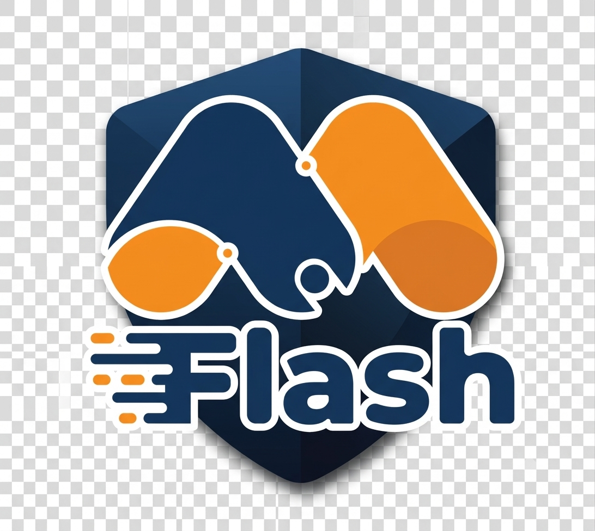

[index.html](https://github.com/user-attachments/files/30315922/index.html)
<!DOCTYPE html>
<html lang="id">
<head>
<meta charset="UTF-8">
<meta name="viewport" content="width=device-width,initial-scale=1.0">
<title>Compliance Audit SDM — M Flash</title>
<link rel="stylesheet" href="https://cdn.jsdelivr.net/npm/@tabler/icons-webfont@3.10.0/dist/tabler-icons.min.css">

</head>
<body class="login-active">

<!-- ===== LOGIN SCREEN ===== -->

  

    

      
<i class="ti ti-shield-check"></i>

      
Compliance Audit SDM

      
M Flash · Masuk untuk melanjutkan

    

    

      <button class="lc-tab active" id="tabAdmin" onclick="switchLoginTab('admin')"><i class="ti ti-lock"></i> Admin</button>
      <button class="lc-tab" id="tabUser" onclick="switchLoginTab('user')"><i class="ti ti-eye"></i> User</button>
    

    

      
Password salah. Silakan coba lagi.

      

        

          <label>Password Admin</label>
          <input class="lc-inp" type="password" id="loginPwd" placeholder="Masukkan password admin"
            onkeydown="if(event.key==='Enter')doLogin()">
        

        <button class="lc-btn admin" onclick="doLogin()"><i class="ti ti-login"></i> Masuk sebagai Admin</button>
      

      

        

          <i class="ti ti-info-circle"></i>
          Akses <strong>User</strong> tidak memerlukan password, namun <strong>tidak dapat menambah, mengedit, atau menghapus data</strong> apapun.
        

        <button class="lc-btn user" onclick="doLoginUser()"><i class="ti ti-eye"></i> Masuk sebagai User (Lihat Saja)</button>
      

      
M Flash Compliance Audit System · v4.0

    

  

<!-- PRINT FRAME (surat panggilan only) -->

<!-- SIDEBAR -->
<aside class="sidebar" id="sidebar">
  

    
    

COMPLIANCE AUDIT

M FLASH

  

  

    
Utama

    <button class="nav-item active" onclick="showPage('dashboard',this)"><i class="ti ti-dashboard"></i>Dashboard</button>
    <button class="nav-item" onclick="showPage('karyawan',this)"><i class="ti ti-id-badge"></i>Data Karyawan</button>
    <button class="nav-item" onclick="showPage('kamus',this)"><i class="ti ti-album"></i>Kamus Pelanggaran</button>
  

  

    
Input Temuan

    <button class="nav-item" onclick="showPage('produktivitas',this)"><i class="ti ti-trending-up"></i>Produktivitas</button>
    <button class="nav-item" onclick="showPage('penampilan',this)"><i class="ti ti-shirt"></i>Penampilan</button>
    <button class="nav-item" onclick="showPage('kebersihan',this)"><i class="ti ti-home"></i>Kebersihan Tempat</button>
  

  

    
Input Tindakan

    <button class="nav-item" onclick="showPage('sp',this)"><i class="ti ti-user-exclamation"></i>SP Performance</button>
    <button class="nav-item" onclick="showPage('teguran',this)"><i class="ti ti-alert-circle"></i>Teguran Peringatan</button>
    <button class="nav-item" onclick="showPage('denda',this)"><i class="ti ti-receipt-dollar"></i>Denda Pelanggaran</button>
    <button class="nav-item" onclick="showPage('berhenti',this)"><i class="ti ti-user-off"></i>Diberhentikan</button>
  

  

    <button class="nav-item" onclick="showPage('pengaturan',this)"><i class="ti ti-settings"></i>Pengaturan</button>
    <button class="nav-item" onclick="showPage('logout',this)"><i class="ti ti-logout"></i>Keluar</button>
  

</aside>
<!-- MAIN -->
<main class="main">
  

    

      
Dashboard Monitoring SDM

      
M Flash Compliance &nbsp;·&nbsp; 

    

    <!-- SEARCH -->
    

      

        <i class="ti ti-search"></i>
        <input class="srch-inp" id="srchInp" type="text" placeholder="Cari nama, divisi, jabatan, SP, teguran, pemberhentian…"
          oninput="runSearch(this.value)" onfocus="if(this.value.trim())openDrop()">
      

      

    

    

      <i class="ti ti-shield-check"></i>Admin
      Live
      <button class="btn-theme" onclick="toggleTheme()" id="themeBtn"><i class="ti ti-moon" id="themeIcon"></i></button>
    

  

  <!-- DASHBOARD -->
  

    

      

<i class="ti ti-users"></i>Total Karyawan

0

Data tersimpan

      

<i class="ti ti-trending-down"></i>Gols di bawah 85%

0

Dari modul Produktivitas · klik untuk detail

      

<i class="ti ti-bolt"></i>Gols &lt;70%

0

Dari modul Produktivitas · klik untuk detail

      

        
<i class="ti ti-alert-triangle"></i>Perlu Dipanggil

        
0

        
Temuan Penampilan &amp; Kebersihan

        
<button class="btn-print" onclick="openSuratPanggilanDipanggil()" style="font-size:10px;padding:3px 8px;margin-top:4px"><i class="ti ti-file-text"></i>Buat Surat Panggilan</button>

      

    

    

      

        
<i class="ti ti-clipboard-list"></i>Daftar Karyawan

        

          <table class="emp-table"><thead><tr>
            <th class="th-sort" onclick="sortEmpTable('nama')" style="cursor:pointer;user-select:none">Karyawan <i class="ti ti-arrows-sort" id="empSortIcon-nama" style="font-size:11px;opacity:.5;margin-left:2px"></i></th>
            <th class="th-sort" onclick="sortEmpTable('div')" style="cursor:pointer;user-select:none">Divisi <i class="ti ti-arrows-sort" id="empSortIcon-div" style="font-size:11px;opacity:.5;margin-left:2px"></i></th>
            <th class="th-sort" onclick="sortEmpTable('join')" style="cursor:pointer;user-select:none">Bergabung <i class="ti ti-arrows-sort" id="empSortIcon-join" style="font-size:11px;opacity:.5;margin-left:2px"></i></th>
            <th class="th-sort" onclick="sortEmpTable('gols')" style="cursor:pointer;user-select:none">Gols <i class="ti ti-arrows-sort" id="empSortIcon-gols" style="font-size:11px;opacity:.5;margin-left:2px"></i></th>
            <th class="th-sort" onclick="sortEmpTable('penampilan')" style="cursor:pointer;user-select:none">Penampilan <i class="ti ti-arrows-sort" id="empSortIcon-penampilan" style="font-size:11px;opacity:.5;margin-left:2px"></i></th>
            <th></th>
          </tr></thead><tbody id="empBody"></tbody></table>
        

        

          Menampilkan 0 dari 0 karyawan
          

            <button class="btn-cancel" id="empPagePrev" onclick="empPageGo(-1)" style="padding:5px 10px;font-size:12px"><i class="ti ti-chevron-left"></i></button>
            Hal 1
            <button class="btn-cancel" id="empPageNext" onclick="empPageGo(1)" style="padding:5px 10px;font-size:12px"><i class="ti ti-chevron-right"></i></button>
          

        

      

      

        

          
<i class="ti ti-database"></i>Database &amp; Export

          
localStorage aktif — data tersimpan otomatis

          

            

0

Records

            

0 KB

Ukuran

          

          

            <button class="btn-excel" onclick="exportExcel()"><i class="ti ti-file-spreadsheet"></i>Export Excel</button>
            <button class="btn-excel-import" onclick="document.getElementById('importXlsx').click()"><i class="ti ti-upload"></i>Import Excel</button>
            <input type="file" id="importXlsx" accept=".xlsx,.xls" style="display:none" onchange="importExcel(event)">
          

        

      

    

    

      

        
<i class="ti ti-chart-bar"></i>Tren Produktivitas

        

          <button class="tab active" onclick="switchTrend('minggu',this)">Minggu</button>
          <button class="tab" onclick="switchTrend('bulan',this)">Bulan</button>
        

        

<canvas id="trendLineChart" style="display:none"></canvas><canvas id="trendPieChart" style="display:none;width:120px!important;height:120px!important;margin:0 auto;display:none"></canvas>

        

          ≥80%
          60-79%
          &lt;60%
        

      

      

        
<i class="ti ti-shirt"></i>Rekap Penampilan

        

      

    

  

  <!-- DATA KARYAWAN -->
  

    

      

        
<i class="ti ti-id-badge"></i>Manajemen Data Karyawan

        

          <button class="btn-excel" onclick="exportExcelPage('karyawan')"><i class="ti ti-file-spreadsheet"></i>Export</button>
          <button class="btn-excel-import" onclick="document.getElementById('importKaryawanXlsx').click()"><i class="ti ti-upload"></i>Import Excel</button>
          <input type="file" id="importKaryawanXlsx" accept=".xlsx,.xls" style="display:none" onchange="importKaryawanExcel(event)">
          <button class="btn-add" onclick="openFormEmp()"><i class="ti ti-plus"></i>Tambah Karyawan</button>
        

      

      

        <button class="filter-btn kry-status-filter active" onclick="setKaryawanStatusFilter('aktif',this)"><i class="ti ti-user-check"></i> Karyawan Aktif</button>
        <button class="filter-btn kry-status-filter" onclick="setKaryawanStatusFilter('nonaktif',this)"><i class="ti ti-user-off"></i> Karyawan Non-Aktif</button>
        <button class="filter-btn kry-status-filter" onclick="setKaryawanStatusFilter('semua',this)"><i class="ti ti-users"></i> Semua</button>
      

      

        

          <i class="ti ti-search" style="position:absolute;left:10px;top:50%;transform:translateY(-50%);font-size:14px;color:var(--text3)"></i>
          <input type="text" id="kry2SearchNama" class="form-input" placeholder="Cari nama karyawan..." style="padding-left:32px;font-size:12px" oninput="setKry2Query('nama',this.value)">
        

        

          <i class="ti ti-building" style="position:absolute;left:10px;top:50%;transform:translateY(-50%);font-size:14px;color:var(--text3)"></i>
          <input type="text" id="kry2SearchDiv" class="form-input" placeholder="Cari divisi..." style="padding-left:32px;font-size:12px" oninput="setKry2Query('div',this.value)">
        

        <button class="btn-cancel" id="kry2SearchReset" onclick="resetKry2Search()" style="padding:6px 12px;font-size:12px;display:none"><i class="ti ti-x"></i> Reset Pencarian</button>
      

      

        <table class="emp-table">
          <thead><tr><th>Foto</th>
            <th class="th-sort" onclick="sortEmpTable2('nama')" style="cursor:pointer;user-select:none">Karyawan <i class="ti ti-arrows-sort" id="emp2SortIcon-nama" style="font-size:11px;opacity:.5;margin-left:2px"></i></th>
            <th class="th-sort" onclick="sortEmpTable2('div')" style="cursor:pointer;user-select:none">Divisi <i class="ti ti-arrows-sort" id="emp2SortIcon-div" style="font-size:11px;opacity:.5;margin-left:2px"></i></th>
            <th class="th-sort" onclick="sortEmpTable2('jabatan')" style="cursor:pointer;user-select:none">Jabatan <i class="ti ti-arrows-sort" id="emp2SortIcon-jabatan" style="font-size:11px;opacity:.5;margin-left:2px"></i></th>
            <th>Bergabung</th><th>Kontrak</th><th>Status</th><th>Aksi</th></tr></thead>
          <tbody id="empBody2"></tbody>
        </table>
      

      
<i class="ti ti-info-circle"></i> Format kolom Excel untuk import: <strong>ID, Nama, Jabatan, Divisi, Tgl Bergabung, Telepon, Kontrak, Catatan</strong> (baris pertama header). Jika ID/Nama sudah ada, data karyawan tersebut akan diperbarui; jika belum ada, karyawan baru akan dibuat. Data ini menjadi data induk yang otomatis dipakai oleh laporan Produktivitas dan modul lainnya.

    

  

  <!-- KAMUS PELANGGARAN -->
  

    

      

        
<i class="ti ti-album"></i>Kamus Pelanggaran

        

          <button class="btn-excel" onclick="exportExcelPage('kamus')"><i class="ti ti-file-spreadsheet"></i>Export</button>
          <button class="btn-excel-import" onclick="document.getElementById('importKamusXlsx').click()"><i class="ti ti-upload"></i>Import Excel</button>
          <input type="file" id="importKamusXlsx" accept=".xlsx,.xls" style="display:none" onchange="importKamusExcel(event)">
          <button class="btn-add" onclick="openFormKamus()"><i class="ti ti-plus"></i>Tambah Jenis Pelanggaran</button>
        

      

      

        <table class="emp-table"><thead><tr><th>Bentuk Pelanggaran</th><th>Nominal Potongan</th><th>Sangsi Lain</th><th>Aksi</th></tr></thead><tbody id="kamusBody"></tbody></table>
      

      
<i class="ti ti-album"></i>
Belum ada data kamus pelanggaran.

      
<i class="ti ti-info-circle"></i> Format kolom Excel untuk import: <strong>BENTUK PELANGGARAN</strong>, <strong>NOMINAL POTONGAN</strong>, <strong>SANGSI LAIN</strong> (baris pertama header).

    

  

  <!-- PRODUKTIVITAS -->
  

    

      

<i class="ti ti-trending-up"></i>MA di atas 85%

0

      

<i class="ti ti-trending-down"></i>MA di bawah 85%

0

    

    

      

        <i class="ti ti-phone-call" style="font-size:20px;color:var(--red)"></i>
        

          
0 karyawan perlu dipanggil

          
MA di bawah 85%

        

      

    

    

      

        
<i class="ti ti-trending-up"></i>Laporan Produktivitas

        

          <button class="btn-excel" onclick="exportExcelPage('produktivitas')"><i class="ti ti-file-spreadsheet"></i>Export</button>
          <button class="btn-excel-import" onclick="document.getElementById('importProdXlsx').click()"><i class="ti ti-upload"></i>Import Excel</button>
          <input type="file" id="importProdXlsx" accept=".xlsx,.xls" style="display:none" onchange="importProdExcel(event)">
          <button class="btn-add" style="background:transparent;color:var(--text2);border:.5px solid var(--border2)" onclick="forceRelinkProduktivitas()"><i class="ti ti-refresh"></i>Cocokkan Ulang</button>
          <button class="btn-add" style="background:var(--red-bg);color:var(--red-txt);border:.5px solid transparent" onclick="clearProduktivitasData()"><i class="ti ti-trash"></i>Hapus Semua</button>
          <button class="btn-add" onclick="openFormProd()"><i class="ti ti-plus"></i>Tambah Manual</button>
        

      

      

        <table class="emp-table"><thead><tr>
          <th class="th-sort" onclick="sortProdTable('nama')" style="cursor:pointer;user-select:none">Nama Karyawan <i class="ti ti-arrows-sort" id="prodSortIcon-nama" style="font-size:11px;opacity:.5;margin-left:2px"></i></th>
          <th class="th-sort" onclick="sortProdTable('div')" style="cursor:pointer;user-select:none">Divisi <i class="ti ti-arrows-sort" id="prodSortIcon-div" style="font-size:11px;opacity:.5;margin-left:2px"></i></th>
          <th class="th-sort" onclick="sortProdTable('ma')" style="cursor:pointer;user-select:none">MA <i class="ti ti-arrows-sort" id="prodSortIcon-ma" style="font-size:11px;opacity:.5;margin-left:2px"></i></th>
          <th>Status</th><th>Aksi</th>
        </tr></thead><tbody id="prodBody"></tbody></table>
      

      

  

    <!-- UPLOAD ZONE DRAG & DROP -->
    

      <i class="ti ti-cloud-upload" style="font-size:40px;color:var(--text3);display:block;margin-bottom:10px"></i>
      
Upload File Gols / MA Produktivitas

      
Klik di sini atau drag &amp; drop file Excel (.xlsx / .xls)

      

        <button class="btn-excel-import" onclick="event.stopPropagation();document.getElementById('importProdXlsx2').click()" style="font-size:12px;padding:7px 18px">
          <i class="ti ti-upload"></i> Pilih File Excel
        </button>
        <button class="btn-add" onclick="event.stopPropagation();openFormProd()" style="font-size:12px;padding:7px 18px;margin-left:0">
          <i class="ti ti-plus"></i> Tambah Manual
        </button>
      

      <input type="file" id="importProdXlsx2" accept=".xlsx,.xls" style="display:none" onchange="importProdExcel(event)">
    

    <!-- FORMAT KOLOM INFO -->
    

      

        <i class="ti ti-table"></i> FORMAT KOLOM EXCEL YANG DIBUTUHKAN
      

      

        <table style="width:100%;border-collapse:collapse;font-size:11px">
          <thead>
            <tr style="background:var(--blue-bg)">
              <th style="padding:6px 10px;text-align:left;color:var(--blue-txt);border:.5px solid var(--border)">NAMA</th>
              <th style="padding:6px 10px;text-align:left;color:var(--blue-txt);border:.5px solid var(--border)">DIVISI</th>
              <th style="padding:6px 10px;text-align:left;color:var(--blue-txt);border:.5px solid var(--border)">MA</th>
              <th style="padding:6px 10px;text-align:left;color:var(--blue-txt);border:.5px solid var(--border)">GOLS</th>
            </tr>
          </thead>
          <tbody>
            <tr>
              <td style="padding:6px 10px;border:.5px solid var(--border);color:var(--text2)">Fulan 1</td>
              <td style="padding:6px 10px;border:.5px solid var(--border);color:var(--text2)">Produksi</td>
              <td style="padding:6px 10px;border:.5px solid var(--border);color:var(--text2)">92.5</td>
              <td style="padding:6px 10px;border:.5px solid var(--border);color:var(--text2)">92.5</td>
            </tr>
            <tr style="background:var(--surface2)">
              <td style="padding:6px 10px;border:.5px solid var(--border);color:var(--text2)">Fulan 2</td>
              <td style="padding:6px 10px;border:.5px solid var(--border);color:var(--text2)">HRD</td>
              <td style="padding:6px 10px;border:.5px solid var(--border);color:var(--text2)">78</td>
              <td style="padding:6px 10px;border:.5px solid var(--border);color:var(--text2)">80</td>
            </tr>
          </tbody>
        </table>
      

      

        <i class="ti ti-info-circle" style="flex-shrink:0;margin-top:1px"></i>
        Baris pertama = header. Kolom MA dan GOLS berisi nilai persentase (contoh: 92.5 artinya 92,5%). Kolom <strong>GOLS</strong> bersifat opsional — jika kosong/tidak ada, nilai GOLS otomatis diambil sama dengan nilai MA. Nama akan dicocokkan otomatis ke Data Karyawan. Jika tidak cocok, baris ditandai <strong style="color:var(--red)">Belum Terhubung</strong> dan wajib dihubungkan manual.
      

    

    <!-- DOWNLOAD TEMPLATE -->
    

      <button onclick="downloadTemplateProd()" style="display:inline-flex;align-items:center;gap:6px;padding:6px 16px;border-radius:var(--radius);border:.5px solid var(--blue);background:var(--blue-bg);color:var(--blue-txt);font-size:11px;font-weight:600;cursor:pointer">
        <i class="ti ti-download"></i> Download Template Excel Kosong
      </button>
    

  

      

        <i class="ti ti-link" style="margin-top:1px;flex-shrink:0"></i>
        
<strong>Terhubung ke Dashboard:</strong> Nilai <strong>GOLS</strong> yang diimport/diinput di sini otomatis tersinkron sebagai kolom <strong>Gols</strong> di tabel Daftar Karyawan pada Dashboard (bar hijau/kuning/merah) — pencocokan dilakukan otomatis berdasarkan nama, tidak perlu dihubungkan manual satu per satu. Kolom Gols sengaja <strong>disembunyikan di tabel ini</strong> agar tidak duplikat; nilainya bisa dilihat langsung di Dashboard. Jika kolom GOLS tidak diisi saat import, nilai MA dipakai sebagai Gols.

      

      
<i class="ti ti-info-circle"></i> Data Karyawan adalah data induk. Saat import Excel, nama akan dicocokkan otomatis ke Data Karyawan; baris yang benar-benar tidak ditemukan namanya akan ditandai <strong>Belum Terhubung</strong> dan wajib dihubungkan manual. Format kolom: <strong>NAMA, DIVISI, MA, GOLS</strong>.

    

  

  <!-- PENAMPILAN -->
  

    

      

        
<i class="ti ti-shirt"></i>Laporan Penampilan Karyawan

        

          <button class="btn-excel" onclick="exportExcelPage('penampilan')"><i class="ti ti-file-spreadsheet"></i>Export</button>
          <button class="btn-add" onclick="openFormPenampilan()"><i class="ti ti-plus"></i>Input Temuan</button>
        

      

      

        <table class="emp-table"><thead><tr><th>Tanggal</th><th>Karyawan</th><th>Nilai</th><th>Seragam</th><th>ID Card</th><th>Kebersihan</th><th>Sepatu</th><th>Rambut</th><th>Catatan</th><th>Aksi</th></tr></thead><tbody id="penampilanBody"></tbody></table>
      

      
<i class="ti ti-shirt"></i>
Belum ada data penampilan.

    

  

  <!-- KEBERSIHAN -->
  

    

      

        
<i class="ti ti-home"></i>Monitoring Kebersihan Tempat Kerja

        

          <button class="btn-excel" onclick="exportExcelPage('kebersihan')"><i class="ti ti-file-spreadsheet"></i>Export</button>
          <button class="btn-add" onclick="openFormKebersihan()"><i class="ti ti-plus"></i>Input Temuan</button>
        

      

      

        <table class="emp-table"><thead><tr><th>Tanggal</th><th>Area</th><th>Meja Kerja</th><th>Ruang Kerja</th><th>Display</th><th>Lantai</th><th>Parkir</th><th>Nilai</th><th>PIC</th><th>Catatan</th><th>Aksi</th></tr></thead><tbody id="kebersihanBody"></tbody></table>
      

      
<i class="ti ti-home"></i>
Belum ada data kebersihan.

    

  

  <!-- SP PERFORMANCE -->
  

    

      

<i class="ti ti-alert-triangle"></i>SP 1

0

      

<i class="ti ti-alert-triangle"></i>SP 2

0

      

<i class="ti ti-user-off"></i>SP 3

0

      

<i class="ti ti-list"></i>Total SP

0

    

    

      

        
<i class="ti ti-user-exclamation"></i>Laporan SP Performance

        

          <button class="btn-excel" onclick="exportExcelPage('sp')"><i class="ti ti-file-spreadsheet"></i>Export</button>
          <button class="btn-add" onclick="openFormSP()"><i class="ti ti-plus"></i>Tambah SP</button>
        

      

      

        <table class="emp-table"><thead><tr><th>Tanggal</th><th>Karyawan</th><th>Divisi</th><th>Level SP</th><th>Alasan</th><th>Diberikan Oleh</th><th>Berlaku s/d</th><th>Status</th><th>Aksi</th></tr></thead><tbody id="spBody"></tbody></table>
      

      
<i class="ti ti-user-exclamation"></i>
Belum ada data SP.

    

  

  <!-- TEGURAN -->
  

    

      

<i class="ti ti-alert-circle"></i>Teguran Lisan

0

      

<i class="ti ti-file-alert"></i>Teguran Tertulis

0

      

<i class="ti ti-list"></i>Total Teguran

0

      

<i class="ti ti-check"></i>Sudah Ditindak

0

    

    

      

        
<i class="ti ti-alert-circle"></i>Laporan Teguran & Peringatan

        

          <button class="btn-excel" onclick="exportExcelPage('teguran')"><i class="ti ti-file-spreadsheet"></i>Export</button>
          <button class="btn-add" onclick="openFormTeguran()"><i class="ti ti-plus"></i>Tambah Teguran</button>
        

      

      

        <table class="emp-table"><thead><tr><th>Tanggal</th><th>Karyawan</th><th>Divisi</th><th>Jenis</th><th>Pelanggaran</th><th>Diberikan Oleh</th><th>Status</th><th>Aksi</th></tr></thead><tbody id="teguranBody"></tbody></table>
      

      
<i class="ti ti-alert-circle"></i>
Belum ada data teguran.

    

  

  <!-- DENDA PELANGGARAN -->
  

    

      

<i class="ti ti-alert-triangle"></i>Total Denda Ringan

Rp 0

0 temuan

      

<i class="ti ti-alert-square"></i>Total Denda Sedang

Rp 0

0 temuan

      

<i class="ti ti-alert-octagon"></i>Total Denda Berat

Rp 0

0 temuan

      

<i class="ti ti-receipt-dollar"></i>Total Keseluruhan

Rp 0

0 temuan

    

    

      

        
<i class="ti ti-receipt-dollar"></i>Laporan Denda Pelanggaran

        

          <button class="btn-excel" onclick="exportExcelPage('denda')"><i class="ti ti-file-spreadsheet"></i>Export</button>
          <button class="btn-add" onclick="openFormDenda()"><i class="ti ti-plus"></i>Tambah Denda</button>
        

      

      

        <table class="emp-table"><thead><tr><th>Tanggal</th><th>Karyawan</th><th>Jabatan</th><th>Cabang</th><th>Level Temuan</th><th>Jumlah Temuan</th><th>Nominal Denda</th><th>Aksi</th></tr></thead><tbody id="dendaBody"></tbody></table>
      

      
<i class="ti ti-receipt-dollar"></i>
Belum ada data denda pelanggaran.

    

  

  <!-- DIBERHENTIKAN -->
  

    

      

<i class="ti ti-shield-x"></i>Fraud

0

Pemberhentian fraud

      

<i class="ti ti-trending-down"></i>Tidak Perform

0

Performa buruk

      

<i class="ti ti-door-exit"></i>Resign

0

Mengundurkan diri

      

<i class="ti ti-user-off"></i>Total Diberhentikan

0

Semua alasan

    

    

      

        
<i class="ti ti-user-off"></i>Laporan Karyawan Diberhentikan

        

          <button class="btn-excel" onclick="exportExcelPage('berhenti')"><i class="ti ti-file-spreadsheet"></i>Export</button>
          <button class="btn-add" onclick="openFormBerhenti()"><i class="ti ti-plus"></i>Tambah Record</button>
        

      

      

        <table class="emp-table"><thead><tr><th>Tgl Berhenti</th><th>Karyawan</th><th>Divisi</th><th>Jabatan</th><th>Alasan</th><th>Keterangan</th><th>Diproses Oleh</th><th>Aksi</th></tr></thead><tbody id="berhentiBody"></tbody></table>
      

      
<i class="ti ti-user-off"></i>
Belum ada data pemberhentian.

    

  

  <!-- PENGATURAN -->
  

    

      
<i class="ti ti-photo" style="font-size:18px"></i>Logo & Nama Menu

      

        

          

Logo Aplikasi

Format PNG atau JPG, disarankan persegi, maks 1MB

          

            

              
            

            <button class="btn-excel-import" onclick="document.getElementById('logoUploadInput').click()"><i class="ti ti-upload"></i>Upload Logo</button>
            <button class="btn-cancel" onclick="resetLogo()" style="padding:6px 12px;font-size:12px"><i class="ti ti-refresh"></i> Reset</button>
            <input type="file" id="logoUploadInput" accept="image/png,image/jpeg" style="display:none" onchange="uploadLogo(event)">
          

        

        

          

Nama Perusahaan (Menu)

Judul yang tampil di bawah logo sidebar

          <input type="text" class="form-input" id="set-logoname" value="COMPLIANCE AUDIT" style="width:180px;padding:4px 8px;font-size:12px" oninput="saveLogoText()">
        

        

          

Nama Divisi

Subjudul kecil di bawah nama perusahaan

          <input type="text" class="form-input" id="set-logosub" value="M FLASH" style="width:180px;padding:4px 8px;font-size:12px" oninput="saveLogoText()">
        

      

    

    

      

        
<i class="ti ti-palette" style="font-size:18px"></i>Tampilan Interface

        

          

            

Ukuran Font

Sesuaikan ukuran teks

            <select class="setting-select" id="set-fontsize" onchange="applySetting('fontsize',this.value)">
              <option value="13px">Kecil (13px)</option>
              <option value="14px" selected>Normal (14px)</option>
              <option value="15px">Sedang (15px)</option>
              <option value="16px">Besar (16px)</option>
            </select>
          

          

            

Warna Aksen

Warna utama tampilan

            <input type="color" class="color-picker" id="set-accent" value="#185FA5" onchange="applySetting('accent',this.value)">
          

          

            

Kontras

Tingkat kontras layar

            
<input type="range" class="setting-range" id="set-contrast" min="80" max="120" value="100" oninput="applySetting('contrast',this.value)">100%

          

          

            

Radius Sudut

Bentuk sudut elemen

            <select class="setting-select" id="set-radius" onchange="applySetting('radius',this.value)">
              <option value="4px">Sharp (4px)</option>
              <option value="8px" selected>Normal (8px)</option>
              <option value="14px">Rounded (14px)</option>
              <option value="20px">Pill (20px)</option>
            </select>
          

        

        
<i class="ti ti-moon" style="font-size:18px"></i>Mode Tampilan

        

          

            

Mode Gelap

Aktifkan tampilan malam

            <button class="toggle" id="toggle-dark" onclick="toggleSetting('dark')"></button>
          

          

            

Mode Otomatis (Siang/Malam)

Ikuti jam sistem (06.00-18.00 terang)

            <button class="toggle" id="toggle-auto" onclick="toggleSetting('auto')"></button>
          

          

            

Sidebar Kompak

Tampilkan sidebar lebih kecil

            <button class="toggle" id="toggle-compact" onclick="toggleSetting('compact')"></button>
          

        

        
<i class="ti ti-background" style="font-size:18px"></i>Background

        

          

            

Warna Background

Warna latar utama

            <input type="color" class="color-picker" id="set-bg" value="#f5f6fa" onchange="applySetting('bg',this.value)">
          

          

            

Pola Background

Tambahkan tekstur latar

            <select class="setting-select" id="set-bgpattern" onchange="applySetting('bgpattern',this.value)">
              <option value="none">Polos</option>
              <option value="dots">Titik-titik</option>
              <option value="grid">Grid</option>
              <option value="stripes">Garis Diagonal</option>
            </select>
          

        

      

      

        
<i class="ti ti-calendar" style="font-size:18px"></i>Pengaturan Tanggal

        

          

            

Format Tanggal

Tampilan format tanggal

            <select class="setting-select" id="set-dateformat" onchange="applySetting('dateformat',this.value)">
              <option value="id">DD Bulan YYYY (Indonesia)</option>
              <option value="dmy">DD/MM/YYYY</option>
              <option value="mdy">MM/DD/YYYY</option>
              <option value="ymd">YYYY-MM-DD</option>
            </select>
          

          

            

Zona Waktu

Zona waktu yang digunakan

            <select class="setting-select" id="set-tz">
              <option value="WIB">WIB (UTC+7)</option>
              <option value="WITA">WITA (UTC+8)</option>
              <option value="WIT">WIT (UTC+9)</option>
            </select>
          

        

        
<i class="ti ti-chart-bar" style="font-size:18px"></i>Tampilan Tren Produktivitas

        

          

            

Jenis Grafik

Pilih tampilan grafik tren

            <select class="setting-select" id="set-charttype" onchange="applySetting('charttype',this.value)">
              <option value="bar">Bar (Batang)</option>
              <option value="line">Line (Garis)</option>
              <option value="pie">Pie (Lingkaran)</option>
              <option value="doughnut">Donut</option>
              <option value="radar">Radar / Spider</option>
            </select>
          

          

            

Animasi Grafik

Efek animasi saat grafik muncul

            <button class="toggle on" id="toggle-anim" onclick="toggleSetting('anim')"></button>
          

          

            

Label Nilai

Tampilkan angka di atas grafik

            <button class="toggle on" id="toggle-labels" onclick="toggleSetting('labels')"></button>
          

        

        
<i class="ti ti-file-export" style="font-size:18px"></i>Pengaturan Export & Import

        

          

            

Format Export Default

Format file saat export

            <select class="setting-select">
              <option value="xlsx">Excel (.xlsx)</option>
              <option value="csv">CSV (.csv)</option>
              <option value="json">JSON (.json)</option>
            </select>
          

          

            

Nama Perusahaan (untuk Surat)

Ditampilkan di header surat

            <input type="text" class="form-input" id="set-company" value="PT. M Flash" style="width:160px;padding:4px 8px;font-size:12px" oninput="saveSettings()">
          

          

            

Alamat Perusahaan

Untuk kop surat panggilan

            <input type="text" class="form-input" id="set-address" value="Jakarta, Indonesia" style="width:160px;padding:4px 8px;font-size:12px; text-align: center;" oninput="saveSettings()">
          

        

        
<i class="ti ti-database" style="font-size:18px"></i>Manajemen Data

        

          

            

Export Semua Data

Unduh backup lengkap

            <button class="btn-excel" onclick="exportExcel()" style="margin-left:0"><i class="ti ti-download"></i>Export Excel</button>
          

          

            

Import Data

Muat data dari file Excel

            <button class="btn-excel-import" onclick="document.getElementById('importXlsx2').click()" style="margin-left:0"><i class="ti ti-upload"></i>Import Excel</button>
            <input type="file" id="importXlsx2" accept=".xlsx,.xls" style="display:none" onchange="importExcel(event)">
          

          

            

Backup ke Disk Lokal

Simpan seluruh database (termasuk foto/PDF bukti) ke file .json — pilih folder/drive tujuan (mis. D:) saat dialog Save muncul

            <button class="btn-print" onclick="backupDatabaseToFile()" style="margin-left:0"><i class="ti ti-device-floppy"></i>Backup ke File</button>
          

          

            

Restore dari Disk Lokal

Pulihkan database dari file backup .json

            <button class="btn-excel-import" onclick="document.getElementById('restoreJsonInput').click()" style="margin-left:0"><i class="ti ti-upload"></i>Restore dari File</button>
            <input type="file" id="restoreJsonInput" accept="application/json,.json" style="display:none" onchange="restoreDatabaseFromFile(event)">
          

          

            

Reset Semua Data

Hapus semua data dan kembali ke awal

            <button class="btn-del" onclick="clearAllData()" style="padding:6px 14px"><i class="ti ti-trash"></i>Reset Database</button>
          

        

        

          <i class="ti ti-info-circle" style="color:var(--blue)"></i> Catatan: karena keterbatasan keamanan browser, aplikasi web tidak bisa otomatis menyimpan langsung ke drive tertentu (mis. D:\) tanpa izin Anda. Gunakan tombol <b>"Backup ke File"</b> di atas — saat dialog Save muncul, arahkan lokasi penyimpanan ke drive/folder yang Anda inginkan (misalnya D:\Backup SDM).
        

        

          
Versi Aplikasi

          
SDM Monitor v3.0

          
M Flash Compliance Audit System

        

      

    

  

  <!-- LOGOUT -->
  

    

      
🚙

      
<i class="ti ti-logout" style="font-size:36px;color:var(--red)"></i>

      
Keluar dari Sistem?

      
Anda akan keluar dari Dashboard Monitoring SDM M Flash. Semua data telah tersimpan secara otomatis.

      

        <button class="btn-logout-cancel" onclick="showPage('dashboard',document.querySelector('.nav-item'))"><i class="ti ti-arrow-left"></i> Kembali ke Dashboard</button>
        <button class="btn-logout-confirm" onclick="doLogout()"><i class="ti ti-logout"></i> Ya, Keluar Sekarang</button>
      

      
Data tersimpan · 

    

  

</main>

<!-- end layout -->

<!-- MODAL DETAIL -->

  
<button class="modal-close" onclick="closeModalDirect()"><i class="ti ti-x"></i></button>

<!-- MODAL DAFTAR NAMA (drill-down dari kartu metrik) -->

  

    <button class="modal-close" onclick="closeListModalDirect()"><i class="ti ti-x"></i></button>
    
<i class="ti ti-list"></i>Daftar Karyawan

    

  

<!-- MODAL BUKTI EVIDENCE (Foto/PDF) -->

  

    <button class="modal-close" onclick="closeEvidenceModalDirect()"><i class="ti ti-x"></i></button>
    
<i class="ti ti-paperclip"></i>Bukti Evidence

    

  

<!-- MODAL SURAT PANGGILAN -->

  

    <button class="modal-close" onclick="closeSuratDirect()"><i class="ti ti-x"></i></button>
    

      
<i class="ti ti-file-text" style="color:var(--blue)"></i>Surat Panggilan Karyawan

      

        <select class="setting-select" id="suratEmpSel" onchange="updateSurat()" style="font-size:12px"><option value="">-- Pilih Karyawan --</option></select>
        <button class="btn-print" onclick="printSurat()"><i class="ti ti-printer"></i>Cetak PDF</button>
        <button class="btn-print" id="btnKirimWA" onclick="kirimSuratWA()" style="background:var(--green-bg);color:var(--green-txt);border-color:transparent"><i class="ti ti-download"></i>Simpan PDF (Download)</button>
      

    

    <!-- WORD-LIKE TOOLBAR -->
    

      

        <select class="toolbar-select" onchange="document.execCommand('fontName',false,this.value);this.blur()" title="Font">
          <option value="Times New Roman">Times New Roman</option>
          <option value="Arial">Arial</option>
          <option value="Georgia">Georgia</option>
          <option value="Calibri">Calibri</option>
          <option value="Courier New">Courier New</option>
        </select>
        <select class="toolbar-select" style="width:56px" onchange="document.execCommand('fontSize',false,this.value);this.blur()" title="Ukuran">
          <option value="2">10</option>
          <option value="3" selected>12</option>
          <option value="4">14</option>
          <option value="5">18</option>
          <option value="6">24</option>
        </select>
      

      

      

        <button class="tb" onclick="document.execCommand('bold')" title="Bold"><b>B</b></button>
        <button class="tb" onclick="document.execCommand('italic')" title="Italic"><i>I</i></button>
        <button class="tb" onclick="document.execCommand('underline')" title="Underline"><u>U</u></button>
        <button class="tb" onclick="document.execCommand('strikeThrough')" title="Coret"><s>S</s></button>
      

      

      

        <button class="tb" onclick="document.execCommand('justifyLeft')" title="Kiri">⬅</button>
        <button class="tb" onclick="document.execCommand('justifyCenter')" title="Tengah">↔</button>
        <button class="tb" onclick="document.execCommand('justifyRight')" title="Kanan">➡</button>
        <button class="tb" onclick="document.execCommand('justifyFull')" title="Rata kiri-kanan">⬌</button>
      

      

      

        <button class="tb" onclick="document.execCommand('insertUnorderedList')" title="List bullet">• List</button>
        <button class="tb" onclick="document.execCommand('insertOrderedList')" title="List angka">1. List</button>
        <button class="tb" onclick="document.execCommand('indent')" title="Indent">→</button>
        <button class="tb" onclick="document.execCommand('outdent')" title="Outdent">←</button>
      

      

      

        <label class="tb" title="Warna teks" style="cursor:pointer;padding:0">
          A
          <input type="color" style="width:20px;height:20px;border:none;cursor:pointer;padding:0;vertical-align:middle" value="#000000" onchange="document.execCommand('foreColor',false,this.value)">
        </label>
        <label class="tb" title="Sorot teks" style="cursor:pointer;padding:0">
          HL
          <input type="color" style="width:20px;height:20px;border:none;cursor:pointer;padding:0;vertical-align:middle" value="#ffff00" onchange="document.execCommand('hiliteColor',false,this.value)">
        </label>
      

      

      

        <button class="tb" onclick="addTableToSurat()" title="Sisipkan Tabel">⊞ Tabel</button>
        <button class="tb" onclick="addHRToSurat()" title="Garis pemisah">─</button>
      

      

      

        <button class="tb" onclick="document.execCommand('undo')" title="Undo">↩</button>
        <button class="tb" onclick="document.execCommand('redo')" title="Redo">↪</button>
        <button class="tb danger" onclick="resetSuratContent()" title="Reset surat">↺ Reset</button>
      

    

    <!-- KOP SURAT EDITOR -->
    

      Edit Kop Surat:
      <button class="kop-btn" onclick="document.getElementById('kopLogoInput').click()"><i class="ti ti-photo"></i> Upload Logo</button>
      <input type="file" id="kopLogoInput" accept="image/*" style="display:none" onchange="handleKopLogo(event)">
      <button class="kop-btn" onclick="removeKopLogo()"><i class="ti ti-trash"></i> Hapus Logo</button>
      <input type="text" class="kop-input" id="kopNamaInput" placeholder="Nama Perusahaan" value="" oninput="updateKopLive()">
      <input type="text" class="kop-input" id="kopAlamatInput" placeholder="Alamat Perusahaan" oninput="updateKopLive()">
      <input type="text" class="kop-input" id="kopTelpInput" placeholder="Telp / Email" oninput="updateKopLive()">
      <select class="kop-select" id="kopGarisType" onchange="updateKopGaris()">
        <option value="double">Garis Ganda</option>
        <option value="single">Garis Tunggal</option>
        <option value="thick">Garis Tebal</option>
        <option value="dashed">Garis Putus</option>
        <option value="none">Tanpa Garis</option>
      </select>
      <input type="color" title="Warna garis kop" value="#1a1d23" id="kopGarisColor" onchange="updateKopGaris()" style="width:28px;height:28px;border:none;border-radius:4px;cursor:pointer;padding:2px">
    

    <!-- SURAT PREVIEW (A4) -->
    

      

        <!-- KOP -->
        

          

          

            <h2 id="sp-company-name" style="font-size:17px;font-weight:800;text-transform:uppercase;letter-spacing:.5px">M FLASH</h2>
            
Jakarta, Indonesia

            
Telp: (021) 000-0000 | Email: hrd@mflash.co.id

          

        

        

        <!-- BODY SURAT -->
        

          
SURAT PANGGILAN KARYAWAN

          
No:001/CAU//

          
Kepada Yth.,

          
<strong id="sp-nama">Nama Karyawan</strong>

          
Jabatan — Divisi

           
          
Dengan hormat,

          
Bersama surat ini, kami mengundang Saudara/i untuk hadir dalam pertemuan yang akan dilaksanakan pada:

          <table style="border-collapse:collapse;width:100%;font-size:12px;margin:4px 0">
            <tr><td style="padding:3px 8px 3px 0;width:160px;vertical-align:top"><strong>Hari / Tanggal</strong></td><td style="padding:3px 0;vertical-align:top">: [Isi hari, tanggal pertemuan]</td></tr>
            <tr><td style="padding:3px 8px 3px 0;vertical-align:top"><strong>Waktu</strong></td><td style="padding:3px 0;vertical-align:top">: [Isi jam]</td></tr>
            <tr><td style="padding:3px 8px 3px 0;vertical-align:top"><strong>Tempat</strong></td><td style="padding:3px 0;vertical-align:top">: Ruang HRD / [Isi lokasi]</td></tr>
            <tr><td style="padding:3px 8px 3px 0;vertical-align:top"><strong>Agenda</strong></td><td style="padding:3px 0;vertical-align:top">: Evaluasi Performa &amp; Produktivitas Kerja</td></tr>
          </table>
          
Pertemuan ini dilaksanakan sehubungan dengan data monitoring yang menunjukkan bahwa produktivitas kerja Saudara/i berada di bawah standar yang ditetapkan perusahaan. Kami berharap Saudara/i dapat hadir tepat waktu dan membawa dokumen pendukung yang diperlukan.

          
Demikian surat panggilan ini kami sampaikan. Atas perhatian dan kehadiran Saudara/i, kami ucapkan terima kasih.

          

            

              
Jakarta, 

              </i></i>

            

            

              
Compliance Auditor

              
PT. Madinah Grup Indonesia

            

          

           
          
Dokumen ini diterbitkan oleh Departemen — M Flash Compliance Audit System

        

      

    

  

<!-- FORM: KARYAWAN -->

  

    
<h3><i class="ti ti-user-plus"></i>Tambah Karyawan</h3><button class="form-close-btn" onclick="closeFormEmp()"><i class="ti ti-x"></i></button>

    

      <input type="hidden" id="empId">
      

        <label class="form-label">Foto Karyawan</label>
        

          
          
<i class="ti ti-camera" style="font-size:28px;color:var(--text3);display:block;margin-bottom:6px"></i>
Klik untuk upload foto karyawan

JPG, PNG, max 2MB

        

        <input type="file" id="empFotoInput" accept="image/*" style="display:none" onchange="handleFotoUpload(event)">
        <input type="hidden" id="empFotoData">
      

      

        
<label class="form-label">Nama Lengkap *</label><input type="text" id="empName" class="form-input" placeholder="Nama lengkap karyawan">

        
<label class="form-label">Jabatan *</label><input type="text" id="empRole" class="form-input" placeholder="cth: Supervisor">

        
<label class="form-label">Divisi / Cabang *</label><input type="text" id="empDiv" class="form-input" placeholder="cth: Produksi">

        
<label class="form-label">Tanggal Bergabung</label><input type="date" id="empJoinDate" class="form-input">

        <input type="hidden" id="empProduktif" value="80">
        <input type="hidden" id="empPenampilan" value="B">
        
<label class="form-label">No. Telepon</label><input type="text" id="empTelp" class="form-input" placeholder="08xx-xxxx-xxxx">

        
<label class="form-label">Status Kontrak</label><select id="empKontrak" class="form-select"><option value="Karyawan Tetap">Karyawan Tetap</option><option value="Karyawan Kontrak">Karyawan Kontrak</option><option value="Magang">Magang</option></select>

        
<label class="form-label">Catatan</label><input type="text" id="empCatatan" class="form-input" placeholder="Catatan opsional">

      

    

    
<button class="btn-cancel" onclick="closeFormEmp()">Batal</button><button class="btn-save" onclick="saveEmployee()"><i class="ti ti-device-floppy"></i>Simpan</button>

  

<!-- FORM: PENAMPILAN -->

  

    
<h3><i class="ti ti-shirt"></i>Input Temuan Penampilan</h3><button class="form-close-btn" onclick="closeFormPenampilan()"><i class="ti ti-x"></i></button>

    

      

        
<label class="form-label">Tanggal *</label><input type="date" id="penTgl" class="form-input">

        

          <label class="form-label">Karyawan *</label>
          <input type="text" id="penEmpSearch" class="form-input" placeholder="Ketik nama karyawan..." autocomplete="off" onfocus="empSelectOpen('penEmp','penEmpSearch','penEmpDrop')" oninput="empSelectOnInput('penEmp','penEmpSearch','penEmpDrop')">
          <select id="penEmp" class="form-select" style="display:none"><option value="">-- Pilih --</option></select>
          

        

      

      
Nilai Penampilan

      

        <input type="radio" name="penNilai" id="pnA" value="A" class="score-radio" checked><label for="pnA" class="score-label" style="background:var(--green-bg);color:var(--green-txt)">A</label>
        <input type="radio" name="penNilai" id="pnB" value="B" class="score-radio"><label for="pnB" class="score-label" style="background:var(--blue-bg);color:var(--blue-txt)">B</label>
        <input type="radio" name="penNilai" id="pnC" value="C" class="score-radio"><label for="pnC" class="score-label" style="background:var(--amber-bg);color:var(--amber-txt)">C</label>
        <input type="radio" name="penNilai" id="pnD" value="D" class="score-radio"><label for="pnD" class="score-label" style="background:var(--red-bg);color:var(--red-txt)">D</label>
      

      
Checklist Penampilan

      

        
<label class="chk-row"><input type="checkbox" id="cSeragam" checked>Seragam Lengkap</label>

        
<label class="chk-row"><input type="checkbox" id="cIdCard" checked>ID Card Terpasang</label>

        
<label class="chk-row"><input type="checkbox" id="cKebersihan" checked>Kebersihan Diri</label>

        
<label class="chk-row"><input type="checkbox" id="cSepatu" checked>Sepatu Standar</label>

        
<label class="chk-row"><input type="checkbox" id="cRambut" checked>Rambut Sesuai SOP</label>

        
<label class="chk-row"><input type="checkbox" id="cAksesoris">Aksesoris Berlebihan</label>

      

      
<label class="form-label">Catatan Temuan</label><textarea id="penCatatan" class="form-textarea"></textarea>

    

    
<button class="btn-cancel" onclick="closeFormPenampilan()">Batal</button><button class="btn-save" onclick="savePenampilan()"><i class="ti ti-device-floppy"></i>Simpan</button>

  

<!-- FORM: KEBERSIHAN -->

  

    
<h3><i class="ti ti-home"></i>Input Temuan Kebersihan</h3><button class="form-close-btn" onclick="closeFormKebersihan()"><i class="ti ti-x"></i></button>

    

      

        
<label class="form-label">Tanggal *</label><input type="date" id="kebTgl" class="form-input">

        
<label class="form-label">Area / Lokasi *</label><input type="text" id="kebArea" class="form-input" placeholder="cth: Lantai 1">

        

          <label class="form-label">PIC</label>
          <input type="text" id="kebPicSearch" class="form-input" placeholder="Ketik nama karyawan..." autocomplete="off" onfocus="empSelectOpen('kebPic','kebPicSearch','kebPicDrop')" oninput="empSelectOnInput('kebPic','kebPicSearch','kebPicDrop')">
          <select id="kebPic" class="form-select" style="display:none"><option value="">-- Pilih --</option></select>
          

        

        
<label class="form-label">Nilai</label><select id="kebNilai" class="form-select"><option value="Baik">Baik</option><option value="Cukup">Cukup</option><option value="Kurang">Kurang</option></select>

        
<label class="form-label">Meja Kerja</label><select id="kebMeja" class="form-select"><option value="Bersih">Bersih</option><option value="Cukup">Cukup</option><option value="Kotor">Kotor</option></select>

        
<label class="form-label">Ruang Kerja</label><select id="kebRuang" class="form-select"><option value="Bersih">Bersih</option><option value="Cukup">Cukup</option><option value="Kotor">Kotor</option></select>

        
<label class="form-label">Display</label><select id="kebDisplay" class="form-select"><option value="Bersih">Bersih</option><option value="Cukup">Cukup</option><option value="Kotor">Kotor</option></select>

        
<label class="form-label">Lantai</label><select id="kebLantai" class="form-select"><option value="Bersih">Bersih</option><option value="Cukup">Cukup</option><option value="Kotor">Kotor</option></select>

        
<label class="form-label">Area Parkir</label><select id="kebParkir" class="form-select"><option value="Bersih">Bersih</option><option value="Cukup">Cukup</option><option value="Kotor">Kotor</option></select>

        
<label class="form-label">Catatan</label><textarea id="kebCatatan" class="form-textarea"></textarea>

      

    

    
<button class="btn-cancel" onclick="closeFormKebersihan()">Batal</button><button class="btn-save" onclick="saveKebersihan()"><i class="ti ti-device-floppy"></i>Simpan</button>

  

<!-- FORM: SP -->

  

    
<h3><i class="ti ti-user-exclamation"></i>Tambah SP Performance</h3><button class="form-close-btn" onclick="closeFormSP()"><i class="ti ti-x"></i></button>

    

      <input type="hidden" id="spId">
      

        
<label class="form-label">Tanggal SP *</label><input type="date" id="spTgl" class="form-input">

        

          <label class="form-label">Karyawan *</label>
          <input type="text" id="spEmpSearch" class="form-input" placeholder="Ketik nama karyawan..." autocomplete="off" onfocus="empSelectOpen('spEmp','spEmpSearch','spEmpDrop')" oninput="empSelectOnInput('spEmp','spEmpSearch','spEmpDrop')">
          <select id="spEmp" class="form-select" style="display:none"><option value="">-- Pilih --</option></select>
          

        

        
<label class="form-label">Level SP *</label><select id="spLevel" class="form-select"><option value="SP 1">SP 1 — Peringatan Pertama</option><option value="SP 2">SP 2 — Peringatan Kedua</option><option value="SP 3">SP 3 — Peringatan Terakhir</option></select>

        
<label class="form-label">Diberikan Oleh</label><input type="text" id="spOleh" class="form-input">

        
<label class="form-label">Alasan *</label><textarea id="spAlasan" class="form-textarea"></textarea>

        
<label class="form-label">Berlaku Sampai</label><input type="date" id="spSampai" class="form-input">

        
<label class="form-label">Status</label><select id="spStatus" class="form-select"><option value="Aktif">Aktif</option><option value="Selesai">Selesai</option><option value="Eskalasi">Dieskalasi</option></select>

      

    

    
<button class="btn-cancel" onclick="closeFormSP()">Batal</button><button class="btn-save" onclick="saveSP()"><i class="ti ti-device-floppy"></i>Simpan</button>

  

<!-- FORM: TEGURAN -->

  

    
<h3><i class="ti ti-alert-circle"></i>Tambah Teguran</h3><button class="form-close-btn" onclick="closeFormTeguran()"><i class="ti ti-x"></i></button>

    

      <input type="hidden" id="tegId">
      

        
<label class="form-label">Tanggal *</label><input type="date" id="tegTgl" class="form-input">

        

          <label class="form-label">Karyawan *</label>
          <input type="text" id="tegEmpSearch" class="form-input" placeholder="Ketik nama karyawan..." autocomplete="off" onfocus="empSelectOpen('tegEmp','tegEmpSearch','tegEmpDrop')" oninput="empSelectOnInput('tegEmp','tegEmpSearch','tegEmpDrop')">
          <select id="tegEmp" class="form-select" style="display:none"><option value="">-- Pilih --</option></select>
          

        

        
<label class="form-label">Jenis Teguran *</label><select id="tegJenis" class="form-select"><option value="Teguran Lisan">Teguran Lisan</option><option value="Teguran Tertulis">Teguran Tertulis</option></select>

        
<label class="form-label">Diberikan Oleh</label><input type="text" id="tegOleh" class="form-input">

        
<label class="form-label">Pelanggaran *</label><textarea id="tegAlasan" class="form-textarea"></textarea>

        
<label class="form-label">Sanksi</label><textarea id="tegSanksi" class="form-textarea"></textarea>

        
<label class="form-label">Status</label><select id="tegStatus" class="form-select"><option value="Proses">Dalam Proses</option><option value="Selesai">Selesai</option></select>

        

          <label class="form-label">Bukti Evidence (Foto &amp; PDF) — Opsional</label>
          

            <button type="button" class="btn-excel-import" onclick="document.getElementById('tegFotoInput').click()"><i class="ti ti-camera"></i>Upload Foto</button>
            <button type="button" class="btn-print" onclick="document.getElementById('tegPdfInput').click()"><i class="ti ti-file-type-pdf"></i>Upload PDF</button>
            <input type="file" id="tegFotoInput" accept="image/*" multiple style="display:none" onchange="handleEvidenceUpload(event,'tegEvidenceData','tegEvidenceList','foto')">
            <input type="file" id="tegPdfInput" accept="application/pdf" multiple style="display:none" onchange="handleEvidenceUpload(event,'tegEvidenceData','tegEvidenceList','pdf')">
          

          

          <input type="hidden" id="tegEvidenceData">
          
Maks 3MB per file. Format foto: JPG/PNG. Bisa upload lebih dari satu file.

        

      

    

    
<button class="btn-cancel" onclick="closeFormTeguran()">Batal</button><button class="btn-save" onclick="saveTeguran()"><i class="ti ti-device-floppy"></i>Simpan</button>

  

<!-- FORM: KAMUS PELANGGARAN -->

  

    
<h3><i class="ti ti-album"></i>Tambah Jenis Pelanggaran</h3><button class="form-close-btn" onclick="closeFormKamus()"><i class="ti ti-x"></i></button>

    

      <input type="hidden" id="kamusId">
      

        
<label class="form-label">Bentuk Pelanggaran *</label><textarea id="kamusBentuk" class="form-textarea" placeholder="Uraikan bentuk pelanggaran"></textarea>

        
<label class="form-label">Nominal Potongan (Rp) *</label><input type="number" id="kamusNominal" class="form-input" min="0" placeholder="Cth: 50000">

        
<label class="form-label">Sangsi Lain</label><textarea id="kamusSangsi" class="form-textarea" placeholder="Cth: SP 1, Teguran tertulis, dll (opsional)"></textarea>

      

    

    
<button class="btn-cancel" onclick="closeFormKamus()">Batal</button><button class="btn-save" onclick="saveKamus()"><i class="ti ti-device-floppy"></i>Simpan</button>

  

<!-- FORM: PRODUKTIVITAS (terhubung ke Data Karyawan / data induk) -->

  

    
<h3><i class="ti ti-trending-up"></i>Tambah Data Produktivitas</h3><button class="form-close-btn" onclick="closeFormProd()"><i class="ti ti-x"></i></button>

    

      <input type="hidden" id="prodId">
      

        

          <label class="form-label">Karyawan (Data Induk) *</label>
          <select id="prodEmpSel" class="form-select" onchange="fillProdEmpInfo()"><option value="">-- Pilih dari Data Karyawan --</option></select>
          
<i class="ti ti-info-circle"></i> Divisi otomatis mengikuti Data Karyawan. Karyawan belum ada? Tambahkan dulu di menu Data Karyawan.

        

        
<label class="form-label">Divisi</label><input type="text" id="prodDivShow" class="form-input" disabled placeholder="-">

        
<label class="form-label">Measured Activity / MA (%) *</label><input type="number" id="prodMa" class="form-input" min="0" max="100" step="0.01" placeholder="Cth: 80.00">

        
<label class="form-label">Gols (%)</label><input type="number" id="prodGols" class="form-input" min="0" max="100" step="0.01" placeholder="Kosongkan = ikut nilai MA">

        

<i class="ti ti-info-circle"></i> Kolom Gols akan tampil di tabel Daftar Karyawan pada Dashboard. Jika dikosongkan, nilai Gols otomatis mengikuti nilai MA.

      

    

    
<button class="btn-cancel" onclick="closeFormProd()">Batal</button><button class="btn-save" onclick="saveProd()"><i class="ti ti-device-floppy"></i>Simpan</button>

  

<!-- FORM: DENDA PELANGGARAN -->

  

    
<h3><i class="ti ti-receipt-dollar"></i>Tambah Denda Pelanggaran</h3><button class="form-close-btn" onclick="closeFormDenda()"><i class="ti ti-x"></i></button>

    

      <input type="hidden" id="dendaId">
      

        
<label class="form-label">Tanggal *</label><input type="date" id="dendaTgl" class="form-input">

        

          <label class="form-label">Karyawan *</label>
          <input type="text" id="dendaEmpSearch" class="form-input" placeholder="Ketik nama karyawan..." autocomplete="off" onfocus="empSelectOpen('dendaEmp','dendaEmpSearch','dendaEmpDrop')" oninput="empSelectOnInput('dendaEmp','dendaEmpSearch','dendaEmpDrop')">
          <select id="dendaEmp" class="form-select" style="display:none" onchange="fillDendaEmpInfo()"><option value="">-- Pilih --</option></select>
          

        

        
<label class="form-label">Jabatan</label><input type="text" id="dendaJabatan" class="form-input" placeholder="Otomatis dari karyawan">

        
<label class="form-label">Nama Cabang *</label><input type="text" id="dendaCabang" class="form-input" placeholder="Otomatis dari Divisi karyawan">

        
<label class="form-label">Level Temuan *</label><select id="dendaLevel" class="form-select"><option value="TEMUAN RINGAN">TEMUAN RINGAN</option><option value="TEMUAN SEDANG">TEMUAN SEDANG</option><option value="TEMUAN BERAT">TEMUAN BERAT</option></select>

        
<label class="form-label">Jumlah Temuan *</label><input type="number" id="dendaJumlah" class="form-input" min="1" value="1">

        
<label class="form-label">Nominal Denda (Rp) *</label><input type="number" id="dendaNominal" class="form-input" min="0" placeholder="Cth: 50000">

        
<label class="form-label">Keterangan Temuan Pelanggaran</label><textarea id="dendaKet" class="form-textarea" placeholder="Uraikan temuan pelanggaran"></textarea>

        

          <label class="form-label">Bukti Evidence (Foto &amp; PDF) — Opsional</label>
          

            <button type="button" class="btn-excel-import" onclick="document.getElementById('dendaFotoInput').click()"><i class="ti ti-camera"></i>Upload Foto</button>
            <button type="button" class="btn-print" onclick="document.getElementById('dendaPdfInput').click()"><i class="ti ti-file-type-pdf"></i>Upload PDF</button>
            <input type="file" id="dendaFotoInput" accept="image/*" multiple style="display:none" onchange="handleEvidenceUpload(event,'dendaEvidenceData','dendaEvidenceList','foto')">
            <input type="file" id="dendaPdfInput" accept="application/pdf" multiple style="display:none" onchange="handleEvidenceUpload(event,'dendaEvidenceData','dendaEvidenceList','pdf')">
          

          

          <input type="hidden" id="dendaEvidenceData">
          
Maks 3MB per file. Format foto: JPG/PNG. Bisa upload lebih dari satu file.

        

      

    

    
<button class="btn-cancel" onclick="closeFormDenda()">Batal</button><button class="btn-save" onclick="saveDenda()"><i class="ti ti-device-floppy"></i>Simpan</button>

  

<!-- FORM: DIBERHENTIKAN -->

  

    
<h3><i class="ti ti-user-off"></i>Tambah Record Pemberhentian</h3><button class="form-close-btn" onclick="closeFormBerhenti()"><i class="ti ti-x"></i></button>

    

      <input type="hidden" id="bhId">
      

        
<label class="form-label">Tanggal Berhenti *</label><input type="date" id="bhTgl" class="form-input">

        

          <label class="form-label">Karyawan *</label>
          <input type="text" id="bhEmpSearch" class="form-input" placeholder="Ketik nama karyawan..." autocomplete="off" onfocus="empSelectOpen('bhEmp','bhEmpSearch','bhEmpDrop')" oninput="empSelectOnInput('bhEmp','bhEmpSearch','bhEmpDrop')">
          <select id="bhEmp" class="form-select" style="display:none"><option value="">-- Pilih --</option></select>
          

        

        
<label class="form-label">Alasan Pemberhentian *</label><select id="bhAlasan" class="form-select"><option value="Fraud">Fraud / Kecurangan</option><option value="Tidak Perform">Tidak Perform</option><option value="Resign">Resign / Mengundurkan Diri</option><option value="Lainnya">Lainnya</option></select>

        
<label class="form-label">Diproses Oleh</label><input type="text" id="bhOleh" class="form-input" placeholder="Nama HRD/Atasan">

        
<label class="form-label">Keterangan Detail *</label><textarea id="bhKet" class="form-textarea" placeholder="Uraikan alasan atau kronologi pemberhentian"></textarea>

      

    

    
<button class="btn-cancel" onclick="closeFormBerhenti()">Batal</button><button class="btn-save" onclick="saveBerhenti()"><i class="ti ti-device-floppy"></i>Simpan</button>

  

<script>
// ============================================================
// DATABASE
// ============================================================
const DB={
  get:(k)=>{try{return JSON.parse(localStorage.getItem('sdm_'+k)||'[]')}catch{return[]}},
  set:(k,v)=>{
    try{
      localStorage.setItem('sdm_'+k,JSON.stringify(v));
      DB._v++;
      return true;
    }catch(err){
      console.error('DB.set gagal untuk',k,err);
      if(typeof toast==='function')toast('Gagal menyimpan: penyimpanan penuh! Kurangi ukuran/jumlah foto & PDF bukti, lalu coba lagi.','error');
      return false;
    }
  },
  _v:0,
  getObj:(k,def)=>{try{return JSON.parse(localStorage.getItem('sdm_obj_'+k)||'null')||def}catch{return def}},
  setObj:(k,v)=>localStorage.setItem('sdm_obj_'+k,JSON.stringify(v)),
  size:()=>{let t=0;for(let k in localStorage)if(k.startsWith('sdm_'))t+=localStorage[k].length;return(t/1024).toFixed(1)+' KB'}
};

function seedData(){
  if(DB.get('produktivitas').length===0){
    DB.set('produktivitas',[
      {id:'p1',nama:'RASYIDI MUHAROR',div:'UNIT MFLASH CONDET',ma:20.50,gols:20.50,empId:null},
      {id:'p2',nama:'FAUZAN RISMAHYUDI',div:'UNIT MFLASH SAWANGAN',ma:44.52,gols:44.52,empId:null},
      {id:'p3',nama:'IRFAN MAULANA',div:'UNIT MFLASH SAWANGAN',ma:14.52,gols:14.52,empId:null},
      {id:'p4',nama:'MUHAMMAD MIRZA SYABANA',div:'UNIT MFLASH SAWANGAN',ma:44.52,gols:44.52,empId:null},
      {id:'p5',nama:'MUHAMMAD RIDWAN FIRDAUS',div:'UNIT MFLASH BINTARA',ma:70.52,gols:70.52,empId:null},
      {id:'p6',nama:'AIMAN DARMAWANGSA',div:'UNIT MFLASH BINTARA',ma:34.52,gols:34.52,empId:null},
      {id:'p7',nama:'IRVAN VAHID SETIAWAN',div:'UNIT MFLASH BINTARA',ma:44.52,gols:44.52,empId:null},
    ]);
  }
  if(DB.get('kamus').length===0){
    DB.set('kamus',[
      {id:'k1',bentuk:'Terlambat masuk kerja tanpa keterangan',nominal:25000,sangsi:'Teguran lisan'},
      {id:'k2',bentuk:'Tidak menggunakan seragam/atribut lengkap',nominal:15000,sangsi:'-'},
      {id:'k3',bentuk:'Meninggalkan area kerja tanpa izin',nominal:50000,sangsi:'Teguran tertulis'},
      {id:'k4',bentuk:'Manipulasi data laporan',nominal:250000,sangsi:'SP 2 / SP 3'},
    ]);
  }
  if(DB.get('employees').length===0){
    DB.set('employees',[
      {id:1,name:'Fulan 1',role:'Supervisor',div:'Produksi',produktif:92,penampilan:'A',telp:'0811-0001',kontrak:'Karyawan Tetap',catatan:'',joinDate:'2020-01-15',foto:''},
      {id:2,name:'Fulan 2',role:'Staff Admin',div:'HRD',produktif:85,penampilan:'A',telp:'0811-0002',kontrak:'Karyawan Tetap',catatan:'',joinDate:'2021-03-01',foto:''},
      {id:3,name:'Fulan 3',role:'Operator',div:'Produksi',produktif:71,penampilan:'B',telp:'0811-0003',kontrak:'Karyawan Kontrak',catatan:'Izin sakit',joinDate:'2022-07-10',foto:''},
      {id:4,name:'Fulan 4',role:'Kasir',div:'Finance',produktif:88,penampilan:'A',telp:'0811-0004',kontrak:'Karyawan Tetap',catatan:'',joinDate:'2019-05-20',foto:''},
      {id:5,name:'Fulan 5',role:'Driver',div:'Gudang',produktif:45,penampilan:'D',telp:'0811-0005',kontrak:'Karyawan Kontrak',catatan:'',joinDate:'2023-01-10',foto:''},
      {id:6,name:'Fulan 6',role:'Receptionist',div:'Front Office',produktif:56,penampilan:'C',telp:'0811-0006',kontrak:'Karyawan Tetap',catatan:'',joinDate:'2021-08-15',foto:''},
    ]);
  }
}
seedData();
autoLinkProduktivitas();

// ============================================================
// HELPERS
// ============================================================
const gc=(v)=>v>=80?'#22c55e':v>=60?'#f59e0b':'#ef4444';
// Indikator warna khusus untuk Gols & MA di modul Produktivitas:
// <85% merah, 85%-99.9% kuning, >=100% hijau
const gcProd=(v)=>v>=100?'#22c55e':v>=85?'#f59e0b':'#ef4444';
const scC={A:'sc-A',B:'sc-B',C:'sc-C',D:'sc-D'};
const avC=['#185FA5','#0F6E56','#BA7517','#993556','#A32D2D','#3B6D11','#534AB7','#993C1D'];
const avB=['#E6F1FB','#E1F5EE','#FAEEDA','#FBEAF0','#FCEBEB','#EAF3DE','#EEEDFE','#FAECE7'];

// Koneksi Gols: Data Karyawan (induk) <-> Modul Produktivitas
// Jika karyawan sudah punya record produktivitas terhubung (empId), Gols dari
// modul Produktivitas dipakai sebagai nilai tunggal (single source of truth).
// Jika belum terhubung, gunakan nilai default/fallback pada Data Karyawan.

// Normalisasi nama untuk pencocokan otomatis (huruf besar/kecil & spasi ganda diabaikan)
// normName: dibuat toleran terhadap perbedaan kecil penulisan nama (spasi ganda,
// spasi non-breaking dari Excel, huruf besar/kecil, tanda baca seperti titik/koma/
// apostrof/tanda hubung) supaya karyawan yang SEBENARNYA sama tidak tertandai
// "Belum terhubung" hanya karena selisih format penulisan.
function normName(s){
  return String(s||'')
    .normalize('NFKD').replace(/[\u0300-\u036f]/g,'') // buang diakritik
    .replace(/[.,'’ʼ`-]/g,'')                          // buang tanda baca umum
    .replace(/\s+/g,' ')                                // rapikan spasi (termasuk NBSP)
    .trim().toLowerCase();
}

// AUTO-LINK: mencocokkan otomatis record Produktivitas <-> Data Karyawan berdasarkan
// nama, agar Gols di Dashboard SELALU sinkron dengan hasil import/input Produktivitas,
// tanpa perlu menghubungkan manual satu per satu. Dipanggil SEKALI per aksi data
// berubah (bukan per baris) supaya ringan & tidak bikin perpindahan halaman lambat.
function autoLinkProduktivitas(){
  const emps=DB.get('employees');
  const recs=DB.get('produktivitas');
  if(!recs.length||!emps.length)return false;
  let changed=false;
  recs.forEach(r=>{
    if(r.empId && !emps.some(e=>e.id===r.empId)){r.empId=null;changed=true}
    if(!r.empId){
      const m=emps.find(e=>normName(e.name)===normName(r.nama));
      if(m){r.empId=m.id;if(m.div)r.div=m.div;changed=true}
    }
  });
  if(changed)DB.set('produktivitas',recs);
  return changed;
}
// Tombol "Cocokkan Ulang": jalankan ulang auto-link secara eksplisit lalu beri tahu
// user persis berapa yang berhasil disambungkan & nama mana saja yang MASIH belum
// cocok (biasanya karena nama di file Excel benar-benar berbeda dari Data Karyawan,
// bukan cuma beda format penulisan) supaya bisa dihubungkan manual dengan tepat.
function forceRelinkProduktivitas(){
  const before=DB.get('produktivitas').filter(r=>!r.empId).length;
  autoLinkProduktivitas();
  renderProdTable();updateMetrics();
  const stillUnlinked=DB.get('produktivitas').filter(r=>!r.empId);
  const fixed=before-stillUnlinked.length;
  if(!stillUnlinked.length){
    toast(fixed>0?`${fixed} data berhasil dicocokkan ke Data Karyawan!`:'Semua data sudah terhubung ke Data Karyawan.');
  }else{
    const names=stillUnlinked.slice(0,3).map(r=>r.nama).join(', ');
    toast(`${fixed>0?fixed+' cocok, ':''}${stillUnlinked.length} nama masih beda dari Data Karyawan (mis. ${names}${stillUnlinked.length>3?', ...':''}). Hubungkan manual lewat tombol link di baris tersebut.`,'error');
  }
}
// Hapus semua data Produktivitas sekaligus (tidak menyentuh Data Karyawan/modul lain).
// Dua kali konfirmasi karena tindakan ini tidak bisa dibatalkan.
function clearProduktivitasData(){
  const recs=DB.get('produktivitas');
  if(!recs.length){toast('Tidak ada data Produktivitas untuk dihapus.','info');return}
  if(!confirm(`Hapus SEMUA ${recs.length} data Produktivitas?\nTindakan ini tidak bisa dibatalkan.`))return;
  if(!confirm('Konfirmasi sekali lagi: yakin ingin menghapus seluruh data Produktivitas?'))return;
  DB.set('produktivitas',[]);
  _prodIdxCache=null;
  renderProdTable();updateMetrics();
  toast('Semua data Produktivitas berhasil dihapus.','error');
}

// INDEX CACHE: peta cepat produktivitas by empId & by nama, dibangun ulang HANYA saat
// data (produktivitas/employees) berubah (ditandai lewat DB._v). Menghindari scan
// ulang seluruh array produktivitas untuk setiap baris karyawan yang dirender —
// inilah perbaikan utama supaya perpindahan halaman tidak lagi berat/lambat.
let _prodIdxCache=null,_prodIdxVer=-1;
function getProdIndex(){
  if(_prodIdxCache&&_prodIdxVer===DB._v)return _prodIdxCache;
  const recs=DB.get('produktivitas');
  const byEmpId=new Map(),byName=new Map();
  recs.forEach(r=>{
    if(r.empId!=null&&r.empId!=='')byEmpId.set(r.empId,r);
    else byName.set(normName(r.nama),r);
  });
  _prodIdxCache={byEmpId,byName};
  _prodIdxVer=DB._v;
  return _prodIdxCache;
}

function empGolsRecord(e){
  const idx=getProdIndex();
  if(idx.byEmpId.has(e.id))return idx.byEmpId.get(e.id);
  const m=idx.byName.get(normName(e.name));
  return m||null;
}
function empGols(e){
  const r=empGolsRecord(e);
  if(r&&r.gols!==undefined&&r.gols!==null&&r.gols!=='')return parseFloat(r.gols)||0;
  if(r&&r.ma!==undefined&&r.ma!==null&&r.ma!=='')return parseFloat(r.ma)||0;
  return parseInt(e.produktif)||0;
}
// DIVISI: agar tampilan Divisi di Data Karyawan selalu mengikuti Divisi yang
// tercatat di modul Produktivitas (jika karyawan sudah terhubung). Jika belum
// terhubung / record produktivitas tidak punya divisi, jatuhkan ke divisi master.
function empDiv(e){
  const r=empGolsRecord(e);
  if(r&&r.div)return r.div;
  return e.div;
}
// STATUS AKTIF/NON-AKTIF: field e.aktif bertipe boolean. Karyawan lama (belum
// pernah diset) dianggap aktif secara default (aktif!==false), supaya data lama
// tidak tiba-tiba hilang begitu fitur ini ditambahkan.
function isEmpActive(e){return e.aktif!==false}

// "Perlu Dipanggil": karyawan yang namanya tercatat di SALAH SATU laporan —
// Laporan Temuan Penampilan (empId) ATAU Monitoring Kebersihan Tempat Kerja (pic).
// Setiap baris di kedua modul ini sudah berarti "temuan" (lihat tombol "Input Temuan"),
// jadi cukup tercatat di salah satunya untuk masuk kategori Perlu Dipanggil.
function empsPerluDipanggil(){
  const emps=DB.get('employees').filter(isEmpActive);
  const penIds=new Set(DB.get('penampilan').map(r=>r.empId));
  const kebIds=new Set(DB.get('kebersihan').map(r=>parseInt(r.pic)).filter(x=>!isNaN(x)));
  return emps.filter(e=>penIds.has(e.id)||kebIds.has(e.id));
}

function av(e){
  const i=(e.id-1)%8;
  const s=e.name.split(' ').map(w=>w[0]||'').join('').substring(0,2).toUpperCase();
  if(e.foto&&e.foto.length>10){
    return`

`;
  }
  return`
${s}
`;
}

function genId(arr){return arr.length>0?Math.max(...arr.map(e=>e.id||0))+1:1}
function toast(msg,type='success'){const t=document.getElementById('toast');t.className='toast '+type;t.innerHTML=(type==='success'?'<i class="ti ti-check"></i>':type==='error'?'<i class="ti ti-x"></i>':'<i class="ti ti-info-circle"></i>')+msg;t.classList.add('show');setTimeout(()=>t.classList.remove('show'),2800)}
function val(id){return document.getElementById(id)?.value||''}
function radio(name){return document.querySelector(`input[name="${name}"]:checked`)?.value||''}
function todayStr(){return new Date().toISOString().split('T')[0]}
function setEmpOptions(selId,list){const emps=list||DB.get('employees');const el=document.getElementById(selId);if(!el)return;el.innerHTML='<option value="">-- Pilih Karyawan --</option>'+emps.map(e=>`<option value="${e.id}">${e.name} — ${e.div}</option>`).join('')}

// ============================================================
// SEARCHABLE KARYAWAN SELECT (ketik nama manual)
// ============================================================
document.addEventListener('click',e=>{
  if(!e.target.closest('.emp-select-wrap')){
    document.querySelectorAll('.emp-select-drop.open').forEach(d=>d.classList.remove('open'));
  }
});
function empSelectBuildDrop(selectId,dropId,query){
  const sel=document.getElementById(selectId),drop=document.getElementById(dropId);
  if(!sel||!drop)return;
  const q=(query||'').trim().toLowerCase();
  const opts=Array.from(sel.options).filter(o=>o.value);
  const filtered=q?opts.filter(o=>o.textContent.toLowerCase().includes(q)):opts;
  drop.innerHTML=filtered.length?filtered.map(o=>`
${o.textContent}
`).join(''):'
Karyawan tidak ditemukan
';
}
function empSelectOpen(selectId,inputId,dropId){
  const sel=document.getElementById(selectId),inp=document.getElementById(inputId);
  if(!sel||!inp)return;
  // jika sudah ada pilihan valid, tampilkan seluruh daftar saat difokuskan; kalau sedang mengetik, tetap pakai filter berjalan
  empSelectBuildDrop(selectId,dropId,sel.value?'':inp.value);
  empSelectOpen_(dropId);
}
function empSelectOpen_(dropId){document.getElementById(dropId)?.classList.add('open')}
function empSelectClose(dropId){document.getElementById(dropId)?.classList.remove('open')}
function empSelectOnInput(selectId,inputId,dropId){
  const sel=document.getElementById(selectId),inp=document.getElementById(inputId);
  if(!sel||!inp)return;
  sel.value=''; // kosongkan pilihan sampai user klik salah satu hasil pencarian
  empSelectBuildDrop(selectId,dropId,inp.value);
  empSelectOpen_(dropId);
}
function empSelectSync(selectId,inputId,dropId){
  const sel=document.getElementById(selectId),inp=document.getElementById(inputId);
  if(!sel||!inp)return;
  const opt=sel.options[sel.selectedIndex];
  inp.value=(opt&&opt.value)?opt.textContent:'';
  empSelectBuildDrop(selectId,dropId,'');
  const drop=document.getElementById(dropId);
  if(drop&&!drop.dataset.bound){
    drop.addEventListener('click',ev=>{
      const item=ev.target.closest('.emp-select-item');if(!item)return;
      sel.value=item.getAttribute('data-value');
      inp.value=item.getAttribute('data-label');
      empSelectClose(dropId);
      sel.dispatchEvent(new Event('change'));
    });
    drop.dataset.bound='1';
  }
}
function closeAll(){['formEmpOverlay','formKamusOverlay','formProdOverlay','formPerformaOverlay','formPenampilanOverlay','formKebersihanOverlay','formSPOverlay','formTeguranOverlay','formDendaOverlay','formBerhentiOverlay','listModalOverlay','evidenceModalOverlay'].forEach(id=>document.getElementById(id)?.classList.remove('open'));closeModalDirect()}
document.addEventListener('keydown',e=>{if(e.key==='Escape')closeAll()});

function fmtJoin(d){if(!d)return '-';try{const dt=new Date(d);return dt.toLocaleDateString('id-ID',{day:'numeric',month:'short',year:'numeric'})}catch{return d}}
function fmtRp(v){return 'Rp '+ (parseInt(v)||0).toLocaleString('id-ID')}

// ============================================================
// METRICS
// ============================================================
let trendLineChartInst=null;
let trendPieChartInst=null;

function updateMetrics(){
  autoLinkProduktivitas();
  const emps=DB.get('employees').filter(isEmpActive);
  const total=emps.length;
  const golsList=emps.map(e=>empGols(e));
  const s=(id,v)=>{const el=document.getElementById(id);if(el)el.textContent=v};
  s('m-total',total);s('m-low',golsList.filter(v=>v<85).length);
  s('m-tegur',golsList.filter(v=>v<70).length);
  s('m-warn',empsPerluDipanggil().length);
  s('db-records',total);s('db-size',DB.size());
  const prods=DB.get('produktivitas');
  s('prod-ma-high',prods.filter(r=>(parseFloat(r.ma)||0)>=85).length);
  s('prod-ma-low',prods.filter(r=>(parseFloat(r.ma)||0)<85).length);
  s('prod-call-count',prods.filter(r=>(parseFloat(r.ma)||0)<85).length);
  const sps=DB.get('sp');
  s('sp1-count',sps.filter(x=>x.level==='SP 1').length);s('sp2-count',sps.filter(x=>x.level==='SP 2').length);s('sp3-count',sps.filter(x=>x.level==='SP 3').length);s('sp-total',sps.length);
  const tegs=DB.get('teguran');
  s('teg-lisan',tegs.filter(x=>x.jenis==='Teguran Lisan').length);s('teg-tulis',tegs.filter(x=>x.jenis==='Teguran Tertulis').length);s('teg-total',tegs.length);s('teg-selesai',tegs.filter(x=>x.status==='Selesai').length);
  const bhs=DB.get('berhenti');
  s('bh-fraud',bhs.filter(x=>x.alasan==='Fraud').length);s('bh-perform',bhs.filter(x=>x.alasan==='Tidak Perform').length);s('bh-resign',bhs.filter(x=>x.alasan==='Resign').length);s('bh-total',bhs.length);
  const dendas=DB.get('denda');
  const sumLevel=(lvl)=>dendas.filter(x=>x.level===lvl).reduce((a,x)=>a+(parseInt(x.nominal)||0),0);
  const cntLevel=(lvl)=>dendas.filter(x=>x.level===lvl).reduce((a,x)=>a+(parseInt(x.jumlah)||0),0);
  s('denda-ringan-total',fmtRp(sumLevel('TEMUAN RINGAN')));s('denda-ringan-count',cntLevel('TEMUAN RINGAN')+' temuan');
  s('denda-sedang-total',fmtRp(sumLevel('TEMUAN SEDANG')));s('denda-sedang-count',cntLevel('TEMUAN SEDANG')+' temuan');
  s('denda-berat-total',fmtRp(sumLevel('TEMUAN BERAT')));s('denda-berat-count',cntLevel('TEMUAN BERAT')+' temuan');
  s('denda-grand-total',fmtRp(dendas.reduce((a,x)=>a+(parseInt(x.nominal)||0),0)));s('denda-grand-count',dendas.reduce((a,x)=>a+(parseInt(x.jumlah)||0),0)+' temuan');
}

// ============================================================
// DRILL-DOWN: klik angka pada kartu metrik Produktivitas
// menampilkan daftar nama karyawan yang termasuk ke angka itu
// ============================================================
function showProdMetricList(field,above){
  const emps=DB.get('employees');
  const list=DB.get('produktivitas').filter(r=>{
    const v=parseFloat(r[field])||0;
    return above?v>=85:v<85;
  }).map(r=>{
    const e=r.empId?emps.find(x=>x.id===r.empId):null;
    return{nama:e?e.name:r.nama,div:e?e.div:(r.div||'-'),value:parseFloat(r[field])||0};
  });
  const label=field==='gols'?'Gols':'MA';
  openListModal(`${label} ${above?'di atas':'di bawah'} 85% (${list.length})`,list);
}
function openListModal(title,list){
  const t=document.getElementById('listModalTitle');if(t)t.innerHTML=`<i class="ti ti-list"></i>${title}`;
  const body=document.getElementById('listModalBody');if(!body)return;
  if(!list.length){
    body.innerHTML='
<i class="ti ti-users-minus"></i>
Tidak ada karyawan pada kategori ini

';
  }else{
    body.innerHTML=list.map(x=>`

${x.nama}

${x.div}

${x.value.toFixed(2).replace('.',',')}%
`).join('');
  }
  document.getElementById('listModalOverlay').classList.add('open');
}
function closeListModal(e){if(e.target===document.getElementById('listModalOverlay'))closeListModalDirect()}
function closeListModalDirect(){document.getElementById('listModalOverlay').classList.remove('open')}

// ============================================================
// EVIDENCE UPLOAD (Foto & PDF) — dipakai di form Teguran, dll.
// ============================================================
const EVIDENCE_MAX_SIZE=3*1024*1024; // 3MB per file, aman untuk penyimpanan lokal
function evidenceGetArr(hiddenId){
  const raw=document.getElementById(hiddenId)?.value;
  try{return raw?JSON.parse(raw):[]}catch{return []}
}
function evidenceSetArr(hiddenId,arr){
  const el=document.getElementById(hiddenId);if(el)el.value=JSON.stringify(arr);
}
function evidenceRenderChips(hiddenId,listId){
  const arr=evidenceGetArr(hiddenId);
  const list=document.getElementById(listId);if(!list)return;
  if(!arr.length){list.innerHTML='
Belum ada file diupload
';return;}
  list.innerHTML=arr.map((it,i)=>{
    const thumb=it.type==='foto'?``:`
<i class="ti ti-file-type-pdf"></i>
`;
    return`
${thumb}${it.name}<button type="button" onclick="evidenceRemove('${hiddenId}','${listId}',${i})" style="background:none;border:none;color:var(--red);cursor:pointer;font-size:14px;flex-shrink:0"><i class="ti ti-x"></i></button>
`;
  }).join('');
}
function evidenceRemove(hiddenId,listId,idx){
  const arr=evidenceGetArr(hiddenId);
  arr.splice(idx,1);
  evidenceSetArr(hiddenId,arr);
  evidenceRenderChips(hiddenId,listId);
}
function compressEvidenceImage(file,maxDim,quality){
  maxDim=maxDim||1280;quality=quality||0.72;
  return new Promise((resolve,reject)=>{
    const reader=new FileReader();
    reader.onload=e=>{
      const img=new Image();
      img.onload=()=>{
        let w=img.width,h=img.height;
        if(w>maxDim||h>maxDim){
          if(w>h){h=Math.round(h*maxDim/w);w=maxDim}else{w=Math.round(w*maxDim/h);h=maxDim}
        }
        const canvas=document.createElement('canvas');
        canvas.width=w;canvas.height=h;
        const ctx=canvas.getContext('2d');
        ctx.drawImage(img,0,0,w,h);
        try{resolve(canvas.toDataURL('image/jpeg',quality))}catch(err){reject(err)}
      };
      img.onerror=reject;
      img.src=e.target.result;
    };
    reader.onerror=reject;
    reader.readAsDataURL(file);
  });
}
function handleEvidenceUpload(evt,hiddenId,listId,type){
  const files=Array.from(evt.target.files||[]);
  if(!files.length)return;
  let remaining=files.length;
  const arr=evidenceGetArr(hiddenId);
  const finish=()=>{remaining--;if(remaining<=0){evidenceSetArr(hiddenId,arr);evidenceRenderChips(hiddenId,listId)}};
  files.forEach(file=>{
    if(file.size>EVIDENCE_MAX_SIZE){toast(`${file.name} terlalu besar (maks 3MB)`,'error');finish();return}
    if(type==='foto'){
      // foto dikompres & diperkecil dulu supaya hemat ruang penyimpanan
      compressEvidenceImage(file).then(dataUrl=>{arr.push({type,name:file.name,data:dataUrl});finish()}).catch(()=>{toast(`Gagal memproses ${file.name}`,'error');finish()});
    }else{
      const reader=new FileReader();
      reader.onload=e=>{arr.push({type,name:file.name,data:e.target.result});finish()};
      reader.onerror=()=>{toast(`Gagal membaca ${file.name}`,'error');finish()};
      reader.readAsDataURL(file);
    }
  });
  evt.target.value='';
}
function dataURLtoBlob(dataurl){
  const arr=dataurl.split(',');
  const mimeMatch=arr[0].match(/:(.*?);/);
  const mime=mimeMatch?mimeMatch[1]:'application/octet-stream';
  const bstr=atob(arr[1]);
  let n=bstr.length;
  const u8arr=new Uint8Array(n);
  while(n--){u8arr[n]=bstr.charCodeAt(n)}
  return new Blob([u8arr],{type:mime});
}
function openEvidenceModal(evidenceArr,title){
  const body=document.getElementById('evidenceModalBody');
  document.getElementById('evidenceModalTitle').innerHTML=`<i class="ti ti-paperclip"></i>${title||'Bukti Evidence'}`;
  window.__evidenceCurrentArr=evidenceArr||[];
  if(!evidenceArr||!evidenceArr.length){
    body.innerHTML='
<i class="ti ti-photo-off"></i>
Belum ada bukti evidence untuk data ini

';
  }else{
    body.innerHTML=evidenceArr.map((it,i)=>{
      const safeName=it.name||(it.type==='foto'?'Foto Bukti':'Dokumen PDF');
      if(it.type==='foto'){
        return`

${safeName}
<button class="btn-detail" onclick="toggleEvidencePreview(${i})" title="Lihat"><i class="ti ti-eye"></i></button><a class="btn-detail" href="${it.data}" download="${safeName}" title="Unduh"><i class="ti ti-download"></i></a>

`;
      }
      return`

<i class="ti ti-file-type-pdf"></i>

${safeName}
<button class="btn-detail" onclick="toggleEvidencePreview(${i})" title="Review PDF"><i class="ti ti-eye"></i> Review</button><a class="btn-detail" href="${it.data}" download="${safeName}" title="Unduh"><i class="ti ti-download"></i></a>

<iframe id="evFrame-${i}" style="width:100%;height:380px;border:none;border-radius:8px;background:#fff" title="${safeName}"></iframe>

`;
    }).join('');
  }
  document.getElementById('evidenceModalOverlay').classList.add('open');
}
function toggleEvidencePreview(i){
  const wrap=document.getElementById('evPreview-'+i);
  if(!wrap)return;
  if(wrap.style.display!=='none'){wrap.style.display='none';return}
  wrap.style.display='block';
  const it=(window.__evidenceCurrentArr||[])[i];
  if(!it||it.type!=='pdf')return;
  const frame=document.getElementById('evFrame-'+i);
  if(frame&&!frame.src){
    try{
      const blob=dataURLtoBlob(it.data);
      frame.src=URL.createObjectURL(blob);
    }catch{
      wrap.innerHTML='
Pratinjau tidak dapat dimuat di sini. Gunakan tombol unduh untuk membuka file PDF.
';
    }
  }
}
function openEvidenceModalById(store,id){
  const recs=DB.get(store);
  const r=recs.find(x=>String(x.id)===String(id));if(!r)return;
  const emps=DB.get('employees');
  const e=r.empId?emps.find(x=>x.id===parseInt(r.empId)):null;
  openEvidenceModal(r.evidence||[],`Bukti Evidence — ${e?e.name:'-'}`);
}
function closeEvidenceModal(e){if(e.target===document.getElementById('evidenceModalOverlay'))closeEvidenceModalDirect()}
function closeEvidenceModalDirect(){
  document.getElementById('evidenceModalOverlay').classList.remove('open');
  document.querySelectorAll('#evidenceModalBody iframe[id^="evFrame-"]').forEach(f=>{if(f.src&&f.src.startsWith('blob:'))URL.revokeObjectURL(f.src)});
}

// RENDER TABLES
// ============================================================
let curFilter='semua';
let empPage=1;
const EMP_PAGE_SIZE=10;
let empSortKey=null, empSortDir=1;
function sortEmpTable(key){
  if(empSortKey===key){empSortDir*=-1}else{empSortKey=key;empSortDir=1}
  empPage=1;
  renderEmpTable(curFilter);
}
function updateEmpSortIcons(){
  ['nama','div','join','gols','penampilan'].forEach(k=>{
    const icon=document.getElementById('empSortIcon-'+k);if(!icon)return;
    if(empSortKey===k){
      icon.className='ti ti-arrow-'+(empSortDir===1?'up':'down');
      icon.style.opacity='1';icon.style.color='var(--blue)';
    }else{
      icon.className='ti ti-arrows-sort';icon.style.opacity='.5';icon.style.color='';
    }
  });
}
const penampilanRank={A:4,B:3,C:2,D:1};
function sortEmpList(list){
  if(!empSortKey)return list;
  const arr=list.slice();
  arr.sort((a,b)=>{
    let av,bv;
    if(empSortKey==='nama'){av=(a.name||'').toLowerCase();bv=(b.name||'').toLowerCase()}
    else if(empSortKey==='div'){av=empDiv(a).toLowerCase();bv=empDiv(b).toLowerCase()}
    else if(empSortKey==='join'){av=a.joinDate?new Date(a.joinDate).getTime():0;bv=b.joinDate?new Date(b.joinDate).getTime():0}
    else if(empSortKey==='gols'){av=empGols(a);bv=empGols(b)}
    else if(empSortKey==='penampilan'){av=penampilanRank[a.penampilan]||0;bv=penampilanRank[b.penampilan]||0}
    if(av<bv)return -1*empSortDir;
    if(av>bv)return 1*empSortDir;
    return 0;
  });
  return arr;
}
function empRowHtml(e){
  const g=empGols(e);
  const hasLink=!!empGolsRecord(e);
  const gCol=gcProd(g);
  return `<tr><td>
${av(e)}

${e.name}

${e.role}

</td><td style="font-size:12px;color:var(--text2)">${empDiv(e)}</td><td style="font-size:11px;color:var(--text3)">${fmtJoin(e.joinDate)}</td><td>

${g}%
${hasLink?'<i class="ti ti-link" title="Nilai dari modul Produktivitas" style="font-size:10px;color:var(--green);margin-left:3px"></i>':''}
  </td><td>${e.penampilan}</td><td><button class="btn-detail" onclick="openModal(${e.id})">Detail →</button></td></tr>`;
}
function renderEmpTable(filter){
  autoLinkProduktivitas();
  let emps=DB.get('employees').filter(isEmpActive);
  const tb=document.getElementById('empBody');if(!tb)return;
  if(!emps.length){tb.innerHTML=`<tr><td colspan="6">
<i class="ti ti-users-minus"></i>
Tidak ada data

</td></tr>`;updateEmpPagination(0,0,0);updateMetrics();updateEmpSortIcons();return}
  emps=sortEmpList(emps);
  updateEmpSortIcons();
  const totalPages=Math.max(1,Math.ceil(emps.length/EMP_PAGE_SIZE));
  if(empPage>totalPages)empPage=totalPages;
  if(empPage<1)empPage=1;
  const start=(empPage-1)*EMP_PAGE_SIZE;
  const pageItems=emps.slice(start,start+EMP_PAGE_SIZE);
  tb.innerHTML=pageItems.map(empRowHtml).join('');
  updateEmpPagination(emps.length,start+1,start+pageItems.length);
  updateMetrics();
}
function updateEmpPagination(total,from,to){
  const info=document.getElementById('empPageInfo');
  const numEl=document.getElementById('empPageNum');
  const prevBtn=document.getElementById('empPagePrev');
  const nextBtn=document.getElementById('empPageNext');
  if(!info)return;
  const totalPages=Math.max(1,Math.ceil(total/EMP_PAGE_SIZE));
  info.textContent=total?`Menampilkan ${from}-${to} dari ${total} karyawan`:'Menampilkan 0 dari 0 karyawan';
  if(numEl)numEl.textContent=`Hal ${empPage} / ${totalPages}`;
  if(prevBtn)prevBtn.disabled=empPage<=1;
  if(nextBtn)nextBtn.disabled=empPage>=totalPages;
  if(prevBtn)prevBtn.style.opacity=prevBtn.disabled?'0.4':'1';
  if(nextBtn)nextBtn.style.opacity=nextBtn.disabled?'0.4':'1';
}
function empPageGo(dir){empPage+=dir;renderEmpTable(curFilter)}
function filterEmp(f,btn){curFilter=f;document.querySelectorAll('.filter-btn').forEach(b=>b.classList.remove('active'));btn?.classList.add('active');empPage=1;renderEmpTable(f)}

let karyawanStatusFilter='aktif';
function setKaryawanStatusFilter(f,btn){
  karyawanStatusFilter=f;
  document.querySelectorAll('.kry-status-filter').forEach(b=>b.classList.remove('active'));
  btn?.classList.add('active');
  renderEmpTable2();
}
let emp2SortKey=null, emp2SortDir=1;
function sortEmpTable2(key){
  if(emp2SortKey===key){emp2SortDir*=-1}else{emp2SortKey=key;emp2SortDir=1}
  renderEmpTable2();
}
let kry2NamaQuery='', kry2DivQuery='';
function setKry2Query(type,v){
  if(type==='nama')kry2NamaQuery=(v||'').trim().toLowerCase();
  else kry2DivQuery=(v||'').trim().toLowerCase();
  const resetBtn=document.getElementById('kry2SearchReset');
  if(resetBtn)resetBtn.style.display=(kry2NamaQuery||kry2DivQuery)?'inline-flex':'none';
  renderEmpTable2();
}
function resetKry2Search(){
  kry2NamaQuery='';kry2DivQuery='';
  const inpN=document.getElementById('kry2SearchNama');if(inpN)inpN.value='';
  const inpD=document.getElementById('kry2SearchDiv');if(inpD)inpD.value='';
  const resetBtn=document.getElementById('kry2SearchReset');if(resetBtn)resetBtn.style.display='none';
  renderEmpTable2();
}
function updateEmp2SortIcons(){
  ['nama','div','jabatan'].forEach(k=>{
    const icon=document.getElementById('emp2SortIcon-'+k);if(!icon)return;
    if(emp2SortKey===k){
      icon.className='ti ti-arrow-'+(emp2SortDir===1?'up':'down');
      icon.style.opacity='1';icon.style.color='var(--blue)';
    }else{
      icon.className='ti ti-arrows-sort';icon.style.opacity='.5';icon.style.color='';
    }
  });
}
function renderEmpTable2(){
  const all=DB.get('employees');const tb=document.getElementById('empBody2');if(!tb)return;
  let emps=karyawanStatusFilter==='semua'?all:karyawanStatusFilter==='nonaktif'?all.filter(e=>!isEmpActive(e)):all.filter(isEmpActive);
  if(kry2NamaQuery)emps=emps.filter(e=>(e.name||'').toLowerCase().includes(kry2NamaQuery));
  if(kry2DivQuery)emps=emps.filter(e=>empDiv(e).toLowerCase().includes(kry2DivQuery));
  if(!emps.length){
    const msg=(kry2NamaQuery||kry2DivQuery)?`Tidak ada karyawan cocok dengan pencarian`:karyawanStatusFilter==='nonaktif'?'Tidak ada karyawan non-aktif':karyawanStatusFilter==='aktif'?'Tidak ada karyawan aktif':'Belum ada data';
    tb.innerHTML=`<tr><td colspan="8">
<i class="ti ti-users-minus"></i>
${msg}

</td></tr>`;updateEmp2SortIcons();return;
  }
  if(emp2SortKey){
    emps=emps.slice().sort((a,b)=>{
      let av,bv;
      if(emp2SortKey==='nama'){av=(a.name||'').toLowerCase();bv=(b.name||'').toLowerCase()}
      else if(emp2SortKey==='div'){av=empDiv(a).toLowerCase();bv=empDiv(b).toLowerCase()}
      else{av=(a.role||'').toLowerCase();bv=(b.role||'').toLowerCase()}
      if(av<bv)return-1*emp2SortDir;
      if(av>bv)return 1*emp2SortDir;
      return 0;
    });
  }
  tb.innerHTML=emps.map(e=>{
    const active=isEmpActive(e);
    return`<tr${active?'':' style="opacity:.55"'}><td>${av(e)}</td><td>

${e.name}

${e.telp||'-'}

</td><td style="font-size:12px;color:var(--text2)">${empDiv(e)}</td><td style="font-size:12px">${e.role}</td><td style="font-size:11px;color:var(--text3)">${fmtJoin(e.joinDate)}</td><td style="font-size:12px">${e.kontrak||'-'}</td><td><label class="status-switch" title="${active?'Aktif — klik untuk nonaktifkan':'Non-Aktif — klik untuk aktifkan'}"><input type="checkbox" ${active?'checked':''} onchange="toggleEmpAktif(${e.id})"></label></td><td style="display:flex;gap:4px"><button class="btn-detail" onclick="openFormEmpEdit(${e.id})"><i class="ti ti-edit"></i></button><button class="btn-del" onclick="deleteEmp(${e.id})"><i class="ti ti-trash"></i></button></td></tr>`;
  }).join('');
  updateEmp2SortIcons();
}
function toggleEmpAktif(id){
  const emps=DB.get('employees');
  const e=emps.find(x=>x.id===id);if(!e)return;
  e.aktif=!isEmpActive(e);
  DB.set('employees',emps);
  renderEmpTable2();renderEmpTable(curFilter);updateMetrics();
  toast(e.aktif?`${e.name} ditandai Aktif`:`${e.name} ditandai Non-Aktif`,e.aktif?'success':'info');
}

function renderPerformaTable(){
  const recs=DB.get('performa');const emps=DB.get('employees');const tb=document.getElementById('performaBody');const em=document.getElementById('performaEmpty');if(!tb)return;
  if(!recs.length){tb.innerHTML='';if(em)em.style.display='block';return}if(em)em.style.display='none';
  tb.innerHTML=[...recs].reverse().map(r=>{const e=emps.find(x=>x.id===r.empId);return`<tr><td style="font-size:12px">${r.tgl}</td><td>
${e?e.name:'-'}
</td><td style="font-size:12px;color:var(--text2)">${e?e.div:'-'}</td><td>

${r.prod}%
</td><td style="font-size:12px;text-align:center">${r.jam||'-'} j</td><td style="font-size:12px">${r.target||'-'}</td><td style="font-size:12px">${r.capaian||'-'}</td><td style="font-size:12px;color:var(--text2);max-width:120px">${r.catatan||'-'}</td><td><button class="btn-del" onclick="deleteRecord('performa','${r.id}',renderPerformaTable)"><i class="ti ti-trash"></i></button></td></tr>`}).join('');
}

function avNama(nama){
  const s=(nama||'?').trim().split(' ').map(w=>w[0]||'').join('').substring(0,2).toUpperCase();
  let h=0;for(let i=0;i<(nama||'').length;i++)h=(h*31+nama.charCodeAt(i))>>>0;
  const i=h%avC.length;
  return`
${s}
`;
}
let prodSortKey=null, prodSortDir=1;
function sortProdTable(key){
  if(prodSortKey===key){prodSortDir*=-1}else{prodSortKey=key;prodSortDir=1}
  renderProdTable();
}
function updateProdSortIcons(){
  ['nama','div','ma'].forEach(k=>{
    const icon=document.getElementById('prodSortIcon-'+k);if(!icon)return;
    if(prodSortKey===k){
      icon.className='ti ti-arrow-'+(prodSortDir===1?'up':'down');
      icon.style.opacity='1';icon.style.color='var(--blue)';
    }else{
      icon.className='ti ti-arrows-sort';icon.style.opacity='.5';icon.style.color='';
    }
  });
}
// Normalisasi nomor telepon Indonesia ke format internasional (62...) untuk WA
function toWaNumber(telp){
  let d=String(telp||'').replace(/\D/g,'');
  if(!d)return'';
  if(d.startsWith('0'))d='62'+d.slice(1);
  else if(!d.startsWith('62'))d='62'+d;
  return d;
}
// Buka WhatsApp Web dengan nomor karyawan (untuk fitur "Perlu Dipanggil")
function renderProdTable(){
  autoLinkProduktivitas();
  const recs=DB.get('produktivitas');const emps=DB.get('employees');const tb=document.getElementById('prodBody');const em=document.getElementById('prodEmpty');if(!tb)return;
  if(!recs.length){tb.innerHTML='';if(em)em.style.display='block';return}if(em)em.style.display='none';
  let list=recs.map(r=>{
    const e=r.empId?emps.find(x=>x.id===r.empId):null;
    const ma=parseFloat(r.ma)||0;
    const gols=(r.gols!==undefined&&r.gols!==null&&r.gols!=='')?(parseFloat(r.gols)||0):ma;
    return{r,e,ma,gols,namaSort:(e?e.name:(r.nama||'')).toLowerCase(),divSort:(e?e.div:(r.div||'')).toLowerCase()};
  });
  if(prodSortKey){
    list=list.slice().sort((a,b)=>{
      let av,bv;
      if(prodSortKey==='nama'){av=a.namaSort;bv=b.namaSort}
      else if(prodSortKey==='div'){av=a.divSort;bv=b.divSort}
      else{av=a.ma;bv=b.ma}
      if(av<bv)return-1*prodSortDir;
      if(av>bv)return 1*prodSortDir;
      return 0;
    });
  }
  tb.innerHTML=list.map(({r,e,ma,gols})=>{
    const perluPanggil=ma<85;
    const waNum=e?toWaNumber(e.telp):'';
    const waBtn=(perluPanggil&&waNum)?`<a class="btn-detail" href="https://wa.me/${waNum}" target="waTab" rel="noopener" style="margin-left:6px;font-size:10px;padding:3px 8px;background:var(--green-bg);color:var(--green-txt);border-color:transparent;text-decoration:none;display:inline-flex;align-items:center;gap:4px" title="Hubungi ${e.name} via WhatsApp"><i class="ti ti-brand-whatsapp"></i>WA</a>`:'';
    const statusCell=perluPanggil?`<i class="ti ti-phone-call"></i>Perlu Dipanggil <button class="btn-detail" style="margin-left:6px;font-size:10px;padding:3px 8px" onclick="suratUntukProduktivitas('${r.id}')"><i class="ti ti-file-text"></i>Surat</button>${waBtn}`:'<i class="ti ti-check"></i>Aman';
    const namaCell=e?`
${e.name}

${e.role}
`:`
${r.nama}

<i class="ti ti-alert-triangle"></i>Belum terhubung
`;
    // Kolom Gols disembunyikan di tabel ini karena sudah tersinkron & tampil di Dashboard (tabel Daftar Karyawan).
    return`<tr><td>
${e?av(e):avNama(r.nama)}
${namaCell}

</td><td style="font-size:12px;color:var(--text2)">${e?e.div:(r.div||'-')}</td><td>

${ma.toFixed(2).replace('.',',')}%
${e?'<i class="ti ti-link" title="Gols tersinkron ke Dashboard" style="font-size:10px;color:var(--green);margin-left:3px"></i>':''}</td><td>${statusCell}</td><td style="display:flex;gap:4px"><button class="btn-detail" onclick="openFormProd('${r.id}')" title="${e?'Edit':'Hubungkan ke Data Karyawan'}"><i class="ti ti-${e?'edit':'link'}"></i></button><button class="btn-del" onclick="deleteRecord('produktivitas','${r.id}',renderProdTable)"><i class="ti ti-trash"></i></button></td></tr>`;
  }).join('');
  updateProdSortIcons();
}
function goDashboardAndOpenSurat(){
  const dashBtn=document.querySelector('.nav-item[onclick*="\'dashboard\'"]');
  showPage('dashboard',dashBtn);
  openSuratPanggilan();
}
function suratUntukProduktivitas(prodId){
  const r=DB.get('produktivitas').find(x=>String(x.id)===String(prodId));if(!r)return;
  goDashboardAndOpenSurat();
  const sel=document.getElementById('suratEmpSel');
  if(r.empId){
    sel.value=r.empId;
    updateSurat();
  }else{
    sel.value='';
    document.getElementById('sp-nama').textContent=r.nama;
    document.getElementById('sp-jabatan').textContent='-';
    document.getElementById('sp-divisi').textContent=r.div||'-';
    toast('Karyawan ini belum terhubung ke Data Karyawan, nama diisi otomatis dari data Produktivitas.','info');
  }
}
function parsePercent(v){
  if(v===null||v===undefined||v==='')return 0;
  if(typeof v==='number')return v<=1?Math.round(v*1000)/10:Math.round(v*10)/10;
  let s=String(v).trim().replace('%','').replace(',','.');
  const n=parseFloat(s);
  return isNaN(n)?0:n;
}

// ============================================================
// PRODUKTIVITAS — terhubung ke Data Karyawan (data induk)
// ============================================================
function openFormProd(id){
  setEmpOptions('prodEmpSel');
  document.getElementById('prodId').value=id||'';
  if(id){
    const r=DB.get('produktivitas').find(x=>String(x.id)===String(id));
    if(!r)return;
    document.getElementById('formProdTitle').textContent=r.empId?'Edit Data Produktivitas':'Hubungkan ke Data Karyawan';
    document.getElementById('prodEmpSel').value=r.empId||'';
    document.getElementById('prodMa').value=r.ma;
    document.getElementById('prodGols').value=(r.gols!==undefined&&r.gols!==null)?r.gols:'';
  }else{
    document.getElementById('formProdTitle').textContent='Tambah Data Produktivitas';
    document.getElementById('prodEmpSel').value='';
    document.getElementById('prodMa').value='';
    document.getElementById('prodGols').value='';
  }
  fillProdEmpInfo();
  document.getElementById('formProdOverlay').classList.add('open');
}
function closeFormProd(){document.getElementById('formProdOverlay').classList.remove('open')}
function fillProdEmpInfo(){
  const empId=val('prodEmpSel');
  const el=document.getElementById('prodDivShow');if(!el)return;
  if(!empId){el.value='';return}
  const e=DB.get('employees').find(x=>x.id===parseInt(empId));
  el.value=e?e.div:'';
}
function saveProd(){
  const empId=val('prodEmpSel'),ma=val('prodMa'),gols=val('prodGols'),id=val('prodId');
  if(!empId){toast('Pilih karyawan dari Data Karyawan (data induk) terlebih dahulu!','error');return}
  if(ma===''){toast('MA wajib diisi!','error');return}
  const e=DB.get('employees').find(x=>x.id===parseInt(empId));
  if(!e){toast('Karyawan tidak ditemukan di Data Karyawan!','error');return}
  const recs=DB.get('produktivitas');
  const maVal=parseFloat(ma)||0;
  const golsVal=gols===''?maVal:(parseFloat(gols)||0);
  const rec={nama:e.name,div:e.div,empId:e.id,ma:maVal,gols:golsVal};
  if(id){
    const i=recs.findIndex(x=>String(x.id)===String(id));
    if(i>=0)recs[i]={...recs[i],...rec};
  }else{
    recs.push({id:'p'+Date.now(),...rec});
  }
  DB.set('produktivitas',recs);
  closeFormProd();renderProdTable();updateMetrics();
  toast('Data produktivitas tersimpan & terhubung ke Data Karyawan!');
}

function handleProdDrop(evt){
  const files=evt.dataTransfer.files;
  if(!files||!files.length)return;
  const file=files[0];
  if(!file.name.match(/\.xlsx?$/i)){toast('Format file harus .xlsx atau .xls','error');return;}
  const fakeEvt={target:{files:[file],value:''}};
  importProdExcel(fakeEvt);
}

function downloadTemplateProd(){
  if(typeof XLSX==='undefined'){toast('Library Excel belum dimuat','error');return;}
  const wb=XLSX.utils.book_new();
  const ws=XLSX.utils.aoa_to_sheet([
    ['NAMA','DIVISI','MA','GOLS'],
    ['Contoh Nama Karyawan','Produksi','92.5','92.5'],
    ['Nama Lainnya','HRD','78','80'],
  ]);
  // Set column widths
  ws['!cols']=[{wch:28},{wch:20},{wch:10},{wch:10}];
  XLSX.utils.book_append_sheet(wb,ws,'Gols Produktivitas');
  XLSX.writeFile(wb,'Template-Gols-Produktivitas.xlsx');
  toast('Template Excel diunduh!');
}

function importProdExcel(evt){
  const file=evt.target.files[0];if(!file)return;
  const reader=new FileReader();
  reader.onload=e=>{
    try{
      const wb=XLSX.read(e.target.result,{type:'binary'});
      const sheet=wb.Sheets[wb.SheetNames[0]];
      const rows=XLSX.utils.sheet_to_json(sheet,{header:1});
      if(!rows.length){toast('File kosong!','error');return}
      const header=rows[0].map(h=>String(h||'').toLowerCase().trim());
      const idxNama=header.findIndex(h=>h.includes('nama'));
      const idxDiv=header.findIndex(h=>h.includes('divisi')||h.includes('unit'));
      const idxMa=header.findIndex(h=>h==='ma'||h.includes('measured')||h.includes('activity'));
      const idxGols=header.findIndex(h=>h==='gols'||h.includes('gol'));
      if(idxNama<0||idxMa<0){toast('Kolom Nama & MA tidak ditemukan di file!','error');return}
      const emps=DB.get('employees');
      let matched=0,unmatched=0;
      const out=rows.slice(1).filter(r=>r[idxNama]).map((r,i)=>{
        const nama=String(r[idxNama]).trim();
        const divExcel=idxDiv>=0?String(r[idxDiv]||'').trim():'';
        const emp=emps.find(x=>normName(x.name)===normName(nama));
        if(emp)matched++;else unmatched++;
        const maVal=parsePercent(r[idxMa]);
        // Kolom GOLS opsional: jika tidak ada/kosong di Excel, Gols ikut nilai MA
        const golsRaw=idxGols>=0?r[idxGols]:undefined;
        const golsVal=(golsRaw!==undefined&&golsRaw!==null&&String(golsRaw).trim()!=='')?parsePercent(golsRaw):maVal;
        // Data Karyawan (master) jadi sumber kebenaran untuk divisi bila cocok
        return{id:'p'+Date.now()+'_'+i,nama:emp?emp.name:nama,div:emp?emp.div:divExcel,ma:maVal,gols:golsVal,empId:emp?emp.id:null};
      });
      if(!out.length){toast('Tidak ada baris data yang valid!','error');return}
      DB.set('produktivitas',out);
      renderProdTable();updateMetrics();
      toast(`Import berhasil! ${matched} data terhubung otomatis ke Data Karyawan${unmatched?`, ${unmatched} perlu dihubungkan manual`:''}. Kolom Gols sudah tersinkron ke Dashboard.`);
    }catch{toast('File tidak valid!','error')}
  };
  reader.readAsBinaryString(file);evt.target.value='';
}

function renderPenampilanTable(){
  const recs=DB.get('penampilan');const emps=DB.get('employees');const tb=document.getElementById('penampilanBody');const em=document.getElementById('penampilanEmpty');if(!tb)return;
  if(!recs.length){tb.innerHTML='';if(em)em.style.display='block';return}if(em)em.style.display='none';
  const ok=(v)=>v?'✓':'✗';
  tb.innerHTML=[...recs].reverse().map(r=>{const e=emps.find(x=>x.id===r.empId);return`<tr><td style="font-size:12px">${r.tgl}</td><td>
${e?e.name:'-'}
</td><td>${r.nilai}</td><td style="text-align:center">${ok(r.seragam)}</td><td style="text-align:center">${ok(r.idcard)}</td><td style="text-align:center">${ok(r.kebersihan)}</td><td style="text-align:center">${ok(r.sepatu)}</td><td style="text-align:center">${ok(r.rambut)}</td><td style="font-size:12px;color:var(--text2)">${r.catatan||'-'}</td><td><button class="btn-del" onclick="deleteRecord('penampilan','${r.id}',renderPenampilanTable)"><i class="ti ti-trash"></i></button></td></tr>`}).join('');
}

function renderKebersihanTable(){
  const recs=DB.get('kebersihan');const emps=DB.get('employees');const tb=document.getElementById('kebersihanBody');const em=document.getElementById('kebersihanEmpty');if(!tb)return;
  if(!recs.length){tb.innerHTML='';if(em)em.style.display='block';return}if(em)em.style.display='none';
  const vc=(v)=>{const c=v==='Bersih'?'var(--green)':v==='Cukup'?'var(--amber)':'var(--red)';return`${v}`};
  tb.innerHTML=[...recs].reverse().map(r=>{const pic=emps.find(x=>x.id===parseInt(r.pic));return`<tr><td style="font-size:12px">${r.tgl}</td><td style="font-weight:600;font-size:12px">${r.area}</td><td style="text-align:center">${vc(r.meja)}</td><td style="text-align:center">${vc(r.ruang)}</td><td style="text-align:center">${vc(r.display)}</td><td style="text-align:center">${vc(r.lantai)}</td><td style="text-align:center">${vc(r.parkir)}</td><td>${r.nilai}</td><td style="font-size:12px">${pic?pic.name:'-'}</td><td style="font-size:12px;color:var(--text2)">${r.catatan||'-'}</td><td><button class="btn-del" onclick="deleteRecord('kebersihan','${r.id}',renderKebersihanTable)"><i class="ti ti-trash"></i></button></td></tr>`}).join('');
}

function renderSPTable(){
  const recs=DB.get('sp');const emps=DB.get('employees');const tb=document.getElementById('spBody');const em=document.getElementById('spEmpty');if(!tb)return;
  if(!recs.length){tb.innerHTML='';if(em)em.style.display='block';return}if(em)em.style.display='none';
  tb.innerHTML=[...recs].reverse().map(r=>{const e=emps.find(x=>x.id===parseInt(r.empId));const lc=r.level==='SP 1'?'sp-1':r.level==='SP 2'?'sp-2':'sp-3';const sc2=r.status==='Aktif'?'s-alpha':r.status==='Selesai'?'s-hadir':'s-izin';return`<tr><td style="font-size:12px">${r.tgl}</td><td>
${e?e.name:'-'}

${e?e.div:''}
</td><td style="font-size:12px;color:var(--text2)">${e?e.div:'-'}</td><td>${r.level}</td><td style="font-size:12px;max-width:140px;color:var(--text2)">${r.alasan}</td><td style="font-size:12px">${r.oleh||'-'}</td><td style="font-size:12px">${r.sampai||'-'}</td><td>${r.status}</td><td><button class="btn-detail" style="margin-right:6px" onclick="openFormSP('${r.id}')"><i class="ti ti-edit"></i></button><button class="btn-del" onclick="deleteRecord('sp','${r.id}',()=>{renderSPTable();updateMetrics()})"><i class="ti ti-trash"></i></button></td></tr>`}).join('');
  updateMetrics();
}

function renderTeguranTable(){
  const recs=DB.get('teguran');const emps=DB.get('employees');const tb=document.getElementById('teguranBody');const em=document.getElementById('teguranEmpty');if(!tb)return;
  if(!recs.length){tb.innerHTML='';if(em)em.style.display='block';return}if(em)em.style.display='none';
  tb.innerHTML=[...recs].reverse().map(r=>{const e=emps.find(x=>x.id===parseInt(r.empId));const jc=r.jenis==='Teguran Lisan'?'sp-1':'sp-2';const sc2=r.status==='Selesai'?'s-hadir':'s-izin';const evCount=r.evidence?r.evidence.length:0;const evBtn=`<button class="btn-detail" style="margin-right:6px;position:relative" title="Lihat Bukti Evidence" onclick="openEvidenceModalById('teguran','${r.id}')"><i class="ti ti-paperclip"></i>${evCount?` ${evCount}`:''}</button>`;return`<tr><td style="font-size:12px">${r.tgl}</td><td>
${e?e.name:'-'}
</td><td style="font-size:12px;color:var(--text2)">${e?e.div:'-'}</td><td>${r.jenis}</td><td style="font-size:12px;max-width:130px;color:var(--text2)">${r.alasan}</td><td style="font-size:12px">${r.oleh||'-'}</td><td>${r.status}</td><td>${evBtn}<button class="btn-detail" style="margin-right:6px" onclick="openFormTeguran('${r.id}')"><i class="ti ti-edit"></i></button><button class="btn-del" onclick="deleteRecord('teguran','${r.id}',()=>{renderTeguranTable();updateMetrics()})"><i class="ti ti-trash"></i></button></td></tr>`}).join('');
  updateMetrics();
}

function renderKamusTable(){
  const recs=DB.get('kamus');const tb=document.getElementById('kamusBody');const em=document.getElementById('kamusEmpty');if(!tb)return;
  if(!recs.length){tb.innerHTML='';if(em)em.style.display='block';return}if(em)em.style.display='none';
  tb.innerHTML=[...recs].reverse().map(r=>`<tr><td style="font-size:12px;max-width:280px;color:var(--text2)">${r.bentuk}</td><td style="font-size:12px;font-weight:700">${fmtRp(r.nominal)}</td><td style="font-size:12px;max-width:220px;color:var(--text2)">${r.sangsi||'-'}</td><td><button class="btn-detail" onclick="editKamus('${r.id}')" style="margin-right:6px"><i class="ti ti-edit"></i></button><button class="btn-del" onclick="deleteRecord('kamus','${r.id}',()=>{renderKamusTable()})"><i class="ti ti-trash"></i></button></td></tr>`).join('');
}
function openFormKamus(){document.getElementById('formKamusTitle').textContent='Tambah Jenis Pelanggaran';document.getElementById('kamusId').value='';['kamusBentuk','kamusSangsi'].forEach(id=>document.getElementById(id).value='');document.getElementById('kamusNominal').value='';document.getElementById('formKamusOverlay').classList.add('open')}
function closeFormKamus(){document.getElementById('formKamusOverlay').classList.remove('open')}
function editKamus(id){const r=DB.get('kamus').find(x=>String(x.id)===String(id));if(!r)return;document.getElementById('formKamusTitle').textContent='Edit Jenis Pelanggaran';document.getElementById('kamusId').value=r.id;document.getElementById('kamusBentuk').value=r.bentuk;document.getElementById('kamusNominal').value=r.nominal;document.getElementById('kamusSangsi').value=r.sangsi||'';document.getElementById('formKamusOverlay').classList.add('open')}
function saveKamus(){
  const bentuk=val('kamusBentuk').trim(),nominal=val('kamusNominal'),sangsi=val('kamusSangsi').trim(),id=val('kamusId');
  if(!bentuk||!nominal){toast('Bentuk Pelanggaran & Nominal Potongan wajib!','error');return}
  const recs=DB.get('kamus');
  if(id){const i=recs.findIndex(x=>String(x.id)===String(id));if(i>-1)recs[i]={...recs[i],bentuk,nominal:parseInt(nominal)||0,sangsi};}
  else{recs.push({id:Date.now().toString(),bentuk,nominal:parseInt(nominal)||0,sangsi});}
  DB.set('kamus',recs);closeFormKamus();renderKamusTable();toast('Kamus pelanggaran disimpan!');
}
function parseNominal(v){
  if(v===null||v===undefined||v==='')return 0;
  if(typeof v==='number')return Math.round(v);
  const digits=String(v).replace(/[^0-9]/g,'');
  return digits?parseInt(digits):0;
}
function importKamusExcel(evt){
  const file=evt.target.files[0];if(!file)return;
  const reader=new FileReader();
  reader.onload=e=>{
    try{
      const wb=XLSX.read(e.target.result,{type:'binary'});
      const sheet=wb.Sheets[wb.SheetNames[0]];
      const rows=XLSX.utils.sheet_to_json(sheet,{header:1});
      if(!rows.length){toast('File kosong!','error');return}
      const header=rows[0].map(h=>String(h||'').toLowerCase().trim());
      const idxBentuk=header.findIndex(h=>h.includes('bentuk')||h.includes('pelanggaran'));
      const idxNominal=header.findIndex(h=>h.includes('nominal')||h.includes('potongan'));
      const idxSangsi=header.findIndex(h=>h.includes('sangsi'));
      if(idxBentuk<0||idxNominal<0){toast('Kolom BENTUK PELANGGARAN & NOMINAL POTONGAN tidak ditemukan di file!','error');return}
      const existing=DB.get('kamus');
      const existingLower=existing.map(r=>(r.bentuk||'').toLowerCase().trim());
      let added=0,skipped=0;
      rows.slice(1).forEach((r,i)=>{
        const bentuk=String(r[idxBentuk]||'').trim();
        if(!bentuk)return;
        if(existingLower.includes(bentuk.toLowerCase())){skipped++;return}
        const nominal=parseNominal(r[idxNominal]);
        const sangsi=idxSangsi>=0?String(r[idxSangsi]||'').trim():'';
        existing.push({id:'k'+Date.now()+'_'+i,bentuk,nominal,sangsi});
        existingLower.push(bentuk.toLowerCase());
        added++;
      });
      if(!added&&!skipped){toast('Tidak ada baris data yang valid!','error');return}
      DB.set('kamus',existing);
      renderKamusTable();
      toast(`Import berhasil! ${added} jenis pelanggaran ditambahkan${skipped?`, ${skipped} duplikat dilewati`:''}.`);
    }catch{toast('File tidak valid!','error')}
  };
  reader.readAsBinaryString(file);evt.target.value='';
}

function renderDendaTable(){
  const recs=DB.get('denda');const emps=DB.get('employees');const tb=document.getElementById('dendaBody');const em=document.getElementById('dendaEmpty');if(!tb)return;
  if(!recs.length){tb.innerHTML='';if(em)em.style.display='block';return}if(em)em.style.display='none';
  const lvlC={'TEMUAN RINGAN':'s-izin','TEMUAN SEDANG':'s-cuti','TEMUAN BERAT':'s-alpha'};
  tb.innerHTML=[...recs].reverse().map(r=>{const e=emps.find(x=>x.id===parseInt(r.empId));const evCount=r.evidence?r.evidence.length:0;const evBtn=`<button class="btn-detail" style="margin-right:6px" title="Lihat Bukti Evidence" onclick="openEvidenceModalById('denda','${r.id}')"><i class="ti ti-paperclip"></i>${evCount?` ${evCount}`:''}</button>`;return`<tr><td style="font-size:12px">${r.tgl}</td><td>
${e?e.name:'-'}
</td><td style="font-size:12px;color:var(--text2)">${r.jabatan||(e?e.role:'-')}</td><td style="font-size:12px;color:var(--text2)">${r.cabang||'-'}</td><td>${r.level}</td><td style="font-size:12px;text-align:center">${r.jumlah||1}</td><td style="font-size:12px;font-weight:700">${fmtRp(r.nominal)}</td><td>${evBtn}<button class="btn-detail" style="margin-right:6px" onclick="openFormDenda('${r.id}')"><i class="ti ti-edit"></i></button><button class="btn-del" onclick="deleteRecord('denda','${r.id}',()=>{renderDendaTable();updateMetrics()})"><i class="ti ti-trash"></i></button></td></tr>`}).join('');
  updateMetrics();
}

function renderBerhentiTable(){
  const recs=DB.get('berhenti');const emps=DB.get('employees');const tb=document.getElementById('berhentiBody');const em=document.getElementById('berhentiEmpty');if(!tb)return;
  if(!recs.length){tb.innerHTML='';if(em)em.style.display='block';return}if(em)em.style.display='none';
  const alC={Fraud:'al-fraud','Tidak Perform':'al-perform',Resign:'al-resign',Lainnya:'al-other'};
  tb.innerHTML=[...recs].reverse().map(r=>{const e=emps.find(x=>x.id===parseInt(r.empId));return`<tr><td style="font-size:12px">${r.tgl}</td><td>
${e?av(e):'
?
'}

${e?e.name:r.empName||'-'}

</td><td style="font-size:12px;color:var(--text2)">${e?e.div:'-'}</td><td style="font-size:12px">${e?e.role:'-'}</td><td>${r.alasan}</td><td style="font-size:12px;color:var(--text2);max-width:150px">${r.ket||'-'}</td><td style="font-size:12px">${r.oleh||'-'}</td><td><button class="btn-detail" style="margin-right:6px" onclick="openFormBerhenti('${r.id}')"><i class="ti ti-edit"></i></button><button class="btn-del" onclick="deleteRecord('berhenti','${r.id}',()=>{renderBerhentiTable();updateMetrics()})"><i class="ti ti-trash"></i></button></td></tr>`}).join('');
  updateMetrics();
}

function deleteRecord(db,id,fn){if(!confirm('Hapus record ini?'))return;DB.set(db,DB.get(db).filter(r=>String(r.id)!==String(id)));if(fn)fn();toast('Record dihapus','error')}

// ============================================================
// FOTO UPLOAD
// ============================================================
function handleFotoUpload(evt){
  const file=evt.target.files[0];if(!file)return;
  if(file.size>2*1024*1024){toast('Ukuran foto maksimal 2MB','error');return}
  const reader=new FileReader();
  reader.onload=e=>{
    const data=e.target.result;
    document.getElementById('empFotoData').value=data;
    const prev=document.getElementById('empFotoPreview');
    const ph=document.getElementById('fotoUploadPlaceholder');
    prev.src=data;prev.style.display='block';ph.style.display='none';
  };
  reader.readAsDataURL(file);
}

// ============================================================
// FORM: KARYAWAN
// ============================================================
function openFormEmp(){
  document.getElementById('formEmpTitle').textContent='Tambah Karyawan Baru';
  document.getElementById('empId').value='';
  document.getElementById('empFotoData').value='';
  const prev=document.getElementById('empFotoPreview');const ph=document.getElementById('fotoUploadPlaceholder');
  prev.src='';prev.style.display='none';ph.style.display='block';
  ['empName','empRole','empDiv','empTelp','empCatatan'].forEach(id=>document.getElementById(id).value='');
  document.getElementById('empProduktif').value='80';
  document.getElementById('empPenampilan').value='A';document.getElementById('empKontrak').value='Karyawan Tetap';
  document.getElementById('empJoinDate').value=todayStr();
  document.getElementById('formEmpOverlay').classList.add('open');
}
function openFormEmpEdit(id){
  const e=DB.get('employees').find(x=>x.id===id);if(!e)return;
  document.getElementById('formEmpTitle').textContent='Edit Data Karyawan';
  document.getElementById('empId').value=e.id;
  document.getElementById('empFotoData').value=e.foto||'';
  const prev=document.getElementById('empFotoPreview');const ph=document.getElementById('fotoUploadPlaceholder');
  if(e.foto){prev.src=e.foto;prev.style.display='block';ph.style.display='none'}else{prev.src='';prev.style.display='none';ph.style.display='block'}
  document.getElementById('empName').value=e.name;document.getElementById('empRole').value=e.role;
  document.getElementById('empDiv').value=e.div;
  document.getElementById('empProduktif').value=e.produktif;document.getElementById('empPenampilan').value=e.penampilan;
  document.getElementById('empTelp').value=e.telp||'';document.getElementById('empKontrak').value=e.kontrak||'Karyawan Tetap';
  document.getElementById('empCatatan').value=e.catatan||'';document.getElementById('empJoinDate').value=e.joinDate||'';
  document.getElementById('formEmpOverlay').classList.add('open');
}
function closeFormEmp(){document.getElementById('formEmpOverlay').classList.remove('open')}
function saveEmployee(){
  const name=val('empName').trim(),role=val('empRole').trim(),div=val('empDiv').trim();
  if(!name||!role||!div){toast('Nama, Jabatan & Divisi wajib!','error');return}
  const emps=DB.get('employees');const editId=val('empId');
  const d={id:editId?parseInt(editId):genId(emps),name,role,div,produktif:parseInt(val('empProduktif'))||80,penampilan:val('empPenampilan'),telp:val('empTelp'),kontrak:val('empKontrak'),catatan:val('empCatatan'),joinDate:val('empJoinDate'),foto:val('empFotoData')};
  if(editId){const i=emps.findIndex(e=>e.id===parseInt(editId));if(i>=0)emps[i]={...emps[i],...d}}else{emps.push(d)}
  DB.set('employees',emps);closeFormEmp();renderEmpTable(curFilter);renderEmpTable2();updateMetrics();toast(editId?'Data diperbarui!':'Karyawan ditambahkan!');
}
function deleteEmp(id){if(!confirm('Hapus karyawan ini?'))return;DB.set('employees',DB.get('employees').filter(e=>e.id!==id));renderEmpTable(curFilter);renderEmpTable2();updateMetrics();toast('Data dihapus','error')}

// ============================================================
// FORM: PERFORMA
// ============================================================
function openFormPerforma(){setEmpOptions('perfEmp');document.getElementById('perfTgl').value=todayStr();document.getElementById('perfProd').value='80';document.getElementById('perfJam').value='8';['perfTarget','perfCapaian','perfCatatan'].forEach(id=>document.getElementById(id).value='');document.getElementById('formPerformaOverlay').classList.add('open')}
function closeFormPerforma(){document.getElementById('formPerformaOverlay').classList.remove('open')}
function savePerforma(){
  const empId=val('perfEmp'),tgl=val('perfTgl');if(!empId||!tgl){toast('Karyawan & Tanggal wajib!','error');return}
  const prod=parseInt(val('perfProd'))||80;
  const d={id:Date.now().toString(),empId:parseInt(empId),tgl,prod,jam:val('perfJam'),target:val('perfTarget'),capaian:val('perfCapaian'),catatan:val('perfCatatan')};
  const emps=DB.get('employees');const i=emps.findIndex(e=>e.id===parseInt(empId));if(i>=0){emps[i].produktif=prod;DB.set('employees',emps)}
  const recs=DB.get('performa');recs.push(d);DB.set('performa',recs);closeFormPerforma();renderPerformaTable();renderEmpTable(curFilter);updateMetrics();toast('Performa disimpan!');
}

// ============================================================
// FORM: PENAMPILAN
// ============================================================
function openFormPenampilan(){setEmpOptions('penEmp');document.getElementById('penTgl').value=todayStr();document.getElementById('pnA').checked=true;['cSeragam','cIdCard','cKebersihan','cSepatu','cRambut'].forEach(id=>{document.getElementById(id).checked=true});document.getElementById('cAksesoris').checked=false;document.getElementById('penCatatan').value='';document.getElementById('formPenampilanOverlay').classList.add('open');empSelectSync('penEmp','penEmpSearch','penEmpDrop')}
function closeFormPenampilan(){document.getElementById('formPenampilanOverlay').classList.remove('open')}
function savePenampilan(){
  const empId=val('penEmp'),tgl=val('penTgl');if(!empId||!tgl){toast('Karyawan & Tanggal wajib!','error');return}
  const nilai=radio('penNilai')||'A';
  const d={id:Date.now().toString(),empId:parseInt(empId),tgl,nilai,seragam:document.getElementById('cSeragam').checked,idcard:document.getElementById('cIdCard').checked,kebersihan:document.getElementById('cKebersihan').checked,sepatu:document.getElementById('cSepatu').checked,rambut:document.getElementById('cRambut').checked,catatan:val('penCatatan')};
  const emps=DB.get('employees');const i=emps.findIndex(e=>e.id===parseInt(empId));if(i>=0){emps[i].penampilan=nilai;DB.set('employees',emps)}
  const recs=DB.get('penampilan');recs.push(d);DB.set('penampilan',recs);closeFormPenampilan();renderPenampilanTable();updateMetrics();toast('Temuan penampilan disimpan!');
}

// ============================================================
// FORM: KEBERSIHAN
// ============================================================
function openFormKebersihan(){setEmpOptions('kebPic');document.getElementById('kebTgl').value=todayStr();document.getElementById('kebArea').value='';document.getElementById('kebNilai').value='Baik';['kebMeja','kebRuang','kebDisplay','kebLantai','kebParkir'].forEach(id=>document.getElementById(id).value='Bersih');document.getElementById('kebCatatan').value='';document.getElementById('formKebersihanOverlay').classList.add('open');empSelectSync('kebPic','kebPicSearch','kebPicDrop')}
function closeFormKebersihan(){document.getElementById('formKebersihanOverlay').classList.remove('open')}
function saveKebersihan(){
  const tgl=val('kebTgl'),area=val('kebArea').trim();if(!tgl||!area){toast('Tanggal & Area wajib!','error');return}
  const d={id:Date.now().toString(),tgl,area,meja:val('kebMeja'),ruang:val('kebRuang'),display:val('kebDisplay'),lantai:val('kebLantai'),parkir:val('kebParkir'),nilai:val('kebNilai'),pic:val('kebPic'),catatan:val('kebCatatan')};
  const recs=DB.get('kebersihan');recs.push(d);DB.set('kebersihan',recs);closeFormKebersihan();renderKebersihanTable();toast('Temuan kebersihan disimpan!');
}

// ============================================================
// FORM: SP
// ============================================================
function openFormSP(id){
  setEmpOptions('spEmp');
  document.getElementById('spId').value=id||'';
  if(id){
    const r=DB.get('sp').find(x=>String(x.id)===String(id));if(!r)return;
    document.getElementById('formSPTitle').textContent='Edit SP Performance';
    document.getElementById('spEmp').value=r.empId||'';
    document.getElementById('spTgl').value=r.tgl||'';
    document.getElementById('spLevel').value=r.level||'SP 1';
    document.getElementById('spOleh').value=r.oleh||'';
    document.getElementById('spAlasan').value=r.alasan||'';
    document.getElementById('spSampai').value=r.sampai||'';
    document.getElementById('spStatus').value=r.status||'Aktif';
  }else{
    document.getElementById('formSPTitle').textContent='Tambah SP Performance';
    document.getElementById('spTgl').value=todayStr();document.getElementById('spEmp').value='';document.getElementById('spSampai').value='';document.getElementById('spAlasan').value='';document.getElementById('spOleh').value='';document.getElementById('spLevel').value='SP 1';document.getElementById('spStatus').value='Aktif';
  }
  document.getElementById('formSPOverlay').classList.add('open');
  empSelectSync('spEmp','spEmpSearch','spEmpDrop');
}
function closeFormSP(){document.getElementById('formSPOverlay').classList.remove('open')}
function saveSP(){
  const id=val('spId');
  const empId=val('spEmp'),tgl=val('spTgl'),alasan=val('spAlasan').trim();if(!empId||!tgl||!alasan){toast('Karyawan, Tanggal & Alasan wajib!','error');return}
  const d={empId:parseInt(empId),tgl,level:val('spLevel'),alasan,oleh:val('spOleh'),sampai:val('spSampai'),status:val('spStatus')};
  const recs=DB.get('sp');
  if(id){const i=recs.findIndex(x=>String(x.id)===String(id));if(i>=0)recs[i]={...recs[i],...d}}
  else{recs.push({id:Date.now().toString(),...d})}
  DB.set('sp',recs);closeFormSP();renderSPTable();updateMetrics();toast(id?'SP diperbarui!':'SP disimpan!');
}

// ============================================================
// FORM: TEGURAN
// ============================================================
function openFormTeguran(id){
  setEmpOptions('tegEmp');
  document.getElementById('tegId').value=id||'';
  if(id){
    const r=DB.get('teguran').find(x=>String(x.id)===String(id));if(!r)return;
    document.getElementById('formTeguranTitle').textContent='Edit Teguran';
    document.getElementById('tegEmp').value=r.empId||'';
    document.getElementById('tegTgl').value=r.tgl||'';
    document.getElementById('tegJenis').value=r.jenis||'Teguran Lisan';
    document.getElementById('tegOleh').value=r.oleh||'';
    document.getElementById('tegAlasan').value=r.alasan||'';
    document.getElementById('tegSanksi').value=r.sanksi||'';
    document.getElementById('tegStatus').value=r.status||'Proses';
    evidenceSetArr('tegEvidenceData',r.evidence||[]);
  }else{
    document.getElementById('formTeguranTitle').textContent='Tambah Teguran';
    document.getElementById('tegTgl').value=todayStr();document.getElementById('tegEmp').value='';['tegAlasan','tegSanksi','tegOleh'].forEach(id=>document.getElementById(id).value='');document.getElementById('tegJenis').value='Teguran Lisan';document.getElementById('tegStatus').value='Proses';
    evidenceSetArr('tegEvidenceData',[]);
  }
  evidenceRenderChips('tegEvidenceData','tegEvidenceList');
  document.getElementById('formTeguranOverlay').classList.add('open');
  empSelectSync('tegEmp','tegEmpSearch','tegEmpDrop');
}
function closeFormTeguran(){document.getElementById('formTeguranOverlay').classList.remove('open')}
function saveTeguran(){
  const id=val('tegId');
  const empId=val('tegEmp'),tgl=val('tegTgl'),alasan=val('tegAlasan').trim();if(!empId||!tgl||!alasan){toast('Karyawan, Tanggal & Alasan wajib!','error');return}
  const d={empId:parseInt(empId),tgl,jenis:val('tegJenis'),alasan,sanksi:val('tegSanksi'),oleh:val('tegOleh'),status:val('tegStatus'),evidence:evidenceGetArr('tegEvidenceData')};
  const recs=DB.get('teguran');
  if(id){const i=recs.findIndex(x=>String(x.id)===String(id));if(i>=0)recs[i]={...recs[i],...d}}
  else{recs.push({id:Date.now().toString(),...d})}
  if(!DB.set('teguran',recs))return; // gagal simpan (mis. penyimpanan penuh) — biarkan modal terbuka, data tidak hilang
  closeFormTeguran();renderTeguranTable();updateMetrics();toast(id?'Teguran diperbarui!':'Teguran disimpan!');
}

// ============================================================
// FORM: DENDA PELANGGARAN
// ============================================================
function openFormDenda(id){
  setEmpOptions('dendaEmp');
  document.getElementById('dendaId').value=id||'';
  if(id){
    const r=DB.get('denda').find(x=>String(x.id)===String(id));if(!r)return;
    document.getElementById('formDendaTitle').textContent='Edit Denda Pelanggaran';
    document.getElementById('dendaEmp').value=r.empId||'';
    document.getElementById('dendaTgl').value=r.tgl||'';
    document.getElementById('dendaJabatan').value=r.jabatan||'';
    document.getElementById('dendaCabang').value=r.cabang||'';
    document.getElementById('dendaLevel').value=r.level||'TEMUAN RINGAN';
    document.getElementById('dendaJumlah').value=r.jumlah||1;
    document.getElementById('dendaNominal').value=r.nominal||'';
    document.getElementById('dendaKet').value=r.keterangan||'';
    evidenceSetArr('dendaEvidenceData',r.evidence||[]);
  }else{
    document.getElementById('formDendaTitle').textContent='Tambah Denda Pelanggaran';
    document.getElementById('dendaTgl').value=todayStr();document.getElementById('dendaEmp').value='';['dendaJabatan','dendaCabang','dendaKet'].forEach(fid=>document.getElementById(fid).value='');document.getElementById('dendaNominal').value='';document.getElementById('dendaJumlah').value='1';document.getElementById('dendaLevel').value='TEMUAN RINGAN';
    evidenceSetArr('dendaEvidenceData',[]);
  }
  evidenceRenderChips('dendaEvidenceData','dendaEvidenceList');
  document.getElementById('formDendaOverlay').classList.add('open');
  empSelectSync('dendaEmp','dendaEmpSearch','dendaEmpDrop');
}
function closeFormDenda(){document.getElementById('formDendaOverlay').classList.remove('open')}
function fillDendaEmpInfo(){const empId=val('dendaEmp');if(!empId)return;const e=DB.get('employees').find(x=>x.id===parseInt(empId));if(e){document.getElementById('dendaJabatan').value=e.role||'';document.getElementById('dendaCabang').value=empDiv(e)||''}}
function saveDenda(){
  const id=val('dendaId');
  const empId=val('dendaEmp'),tgl=val('dendaTgl'),cabang=val('dendaCabang').trim(),keterangan=val('dendaKet').trim(),nominal=val('dendaNominal');
  if(!empId||!tgl||!cabang||!nominal){toast('Karyawan, Tanggal, Cabang & Nominal wajib!','error');return}
  const e=DB.get('employees').find(x=>x.id===parseInt(empId));
  const d={empId:parseInt(empId),tgl,jabatan:val('dendaJabatan')||(e?e.role:''),cabang,level:val('dendaLevel'),keterangan,jumlah:parseInt(val('dendaJumlah'))||1,nominal:parseInt(nominal)||0,evidence:evidenceGetArr('dendaEvidenceData')};
  const recs=DB.get('denda');
  if(id){const i=recs.findIndex(x=>String(x.id)===String(id));if(i>=0)recs[i]={...recs[i],...d}}
  else{recs.push({id:Date.now().toString(),...d})}
  if(!DB.set('denda',recs))return; // gagal simpan (mis. penyimpanan penuh) — biarkan modal terbuka, data tidak hilang
  closeFormDenda();renderDendaTable();updateMetrics();toast(id?'Denda diperbarui!':'Denda pelanggaran disimpan!');
}

// ============================================================
// FORM: DIBERHENTIKAN
// ============================================================
function openFormBerhenti(id){
  setEmpOptions('bhEmp');
  document.getElementById('bhId').value=id||'';
  if(id){
    const r=DB.get('berhenti').find(x=>String(x.id)===String(id));if(!r)return;
    document.getElementById('formBerhentiTitle').textContent='Edit Record Pemberhentian';
    document.getElementById('bhEmp').value=r.empId||'';
    document.getElementById('bhTgl').value=r.tgl||'';
    document.getElementById('bhAlasan').value=r.alasan||'Fraud';
    document.getElementById('bhOleh').value=r.oleh||'';
    document.getElementById('bhKet').value=r.ket||'';
  }else{
    document.getElementById('formBerhentiTitle').textContent='Tambah Record Pemberhentian';
    document.getElementById('bhTgl').value=todayStr();document.getElementById('bhEmp').value='';document.getElementById('bhAlasan').value='Fraud';document.getElementById('bhOleh').value='';document.getElementById('bhKet').value='';
  }
  document.getElementById('formBerhentiOverlay').classList.add('open');
  empSelectSync('bhEmp','bhEmpSearch','bhEmpDrop');
}
function closeFormBerhenti(){document.getElementById('formBerhentiOverlay').classList.remove('open')}
function saveBerhenti(){
  const id=val('bhId');
  const empId=val('bhEmp'),tgl=val('bhTgl'),ket=val('bhKet').trim();if(!empId||!tgl||!ket){toast('Karyawan, Tanggal & Keterangan wajib!','error');return}
  const emps=DB.get('employees');const e=emps.find(x=>x.id===parseInt(empId));
  const d={empId:parseInt(empId),empName:e?e.name:'',tgl,alasan:val('bhAlasan'),ket,oleh:val('bhOleh')};
  const recs=DB.get('berhenti');
  if(id){const i=recs.findIndex(x=>String(x.id)===String(id));if(i>=0)recs[i]={...recs[i],...d}}
  else{recs.push({id:Date.now().toString(),...d})}
  DB.set('berhenti',recs);closeFormBerhenti();renderBerhentiTable();updateMetrics();toast(id?'Record diperbarui!':'Record pemberhentian disimpan!');
}

// ============================================================
// SURAT PANGGILAN
// ============================================================
function openSuratPanggilan(){
  setEmpOptions('suratEmpSel');
  const now=new Date();
  const bln=['Januari','Februari','Maret','April','Mei','Juni','Juli','Agustus','September','Oktober','November','Desember'];
  document.getElementById('sp-bulan').textContent=bln[now.getMonth()];
  document.getElementById('sp-tahun').textContent=now.getFullYear();
  document.getElementById('sp-tgl-surat').textContent=now.getDate()+' '+bln[now.getMonth()]+' '+now.getFullYear();
  const st=DB.getObj('settings',{});
  if(st.company)document.getElementById('sp-company-name').textContent=st.company.toUpperCase();
  if(st.address)document.getElementById('sp-company-address').textContent=st.address;
  if(st.city)document.getElementById('sp-city').textContent=st.city;
  document.getElementById('suratOverlay').classList.add('open');
}
function closeSuratModal(e){if(e.target===document.getElementById('suratOverlay'))closeSuratDirect()}
function closeSuratDirect(){document.getElementById('suratOverlay').classList.remove('open')}
function updateSurat(){
  const empId=val('suratEmpSel');if(!empId)return;
  const e=DB.get('employees').find(x=>x.id===parseInt(empId));if(!e)return;
  document.getElementById('sp-nama').textContent=e.name;
  document.getElementById('sp-jabatan').textContent=e.role;
  document.getElementById('sp-divisi').textContent=e.div;
}
function resetSuratContent(){
  const bln=['Januari','Februari','Maret','April','Mei','Juni','Juli','Agustus','September','Oktober','November','Desember'];
  const now=new Date();
  document.getElementById('sp-nomor').innerHTML=`No: SP-001/HRD/${bln[now.getMonth()]}/${now.getFullYear()}`;
  document.getElementById('suratBody').innerHTML=`
Kepada Yth.,

<strong id="sp-nama">Nama Karyawan</strong>

Jabatan — Divisi
 
Dengan hormat,

Bersama surat ini, kami mengundang Saudara/i untuk hadir dalam pertemuan evaluasi kinerja.
 
<strong>Hari/Tanggal :</strong> [Isi tanggal]

<strong>Waktu &nbsp;&nbsp;&nbsp;&nbsp;&nbsp;&nbsp;&nbsp;&nbsp;:</strong> [Isi jam]

<strong>Tempat &nbsp;&nbsp;&nbsp;&nbsp;&nbsp;&nbsp;:</strong> Ruang HRD

<strong>Agenda &nbsp;&nbsp;&nbsp;&nbsp;&nbsp;&nbsp;:</strong> Evaluasi Performa & Produktivitas
 
Demikian surat ini kami sampaikan. Terima kasih.
`;
}
function printSurat(){
  const toolbar=document.querySelector('.surat-editor-toolbar');const btnRow=document.querySelector('#suratOverlay .modal>div:first-child');
  if(toolbar)toolbar.style.display='none';if(btnRow)btnRow.style.display='none';
  window.print();
  setTimeout(()=>{if(toolbar)toolbar.style.display='';if(btnRow)btnRow.style.display='';},1000);
}

// ============================================================
// MODAL DETAIL
// ============================================================
function openModal(id){
  const e=DB.get('employees').find(x=>x.id===id);if(!e)return;
  const recs=DB.get('performa').filter(r=>r.empId===id);
  const g=empGols(e);
  const linked=empGolsRecord(e);
  const tl=recs.length?[...recs].reverse().slice(0,4).map(r=>`

${r.catatan||'Performa '+r.prod+'%'}

${r.tgl}

`).join(''):'
Belum ada catatan
';
  const fotoHtml=e.foto?``:`${av(e)}`;
  document.getElementById('modalBody').innerHTML=`

${fotoHtml}

${e.name}

${e.role} · ${empDiv(e)}

Bergabung: ${fmtJoin(e.joinDate)}

Penampilan ${e.penampilan}${e.kontrak||'-'}${linked?'':'<i class="ti ti-alert-triangle"></i> Belum terhubung ke Produktivitas'}

${g}%

Gols

No. Telepon

${e.telp||'-'}

Record Performa

${recs.length}

${e.catatan?`
<i class="ti ti-note"></i> ${e.catatan}
`:''}
<i class="ti ti-history"></i>Riwayat Performa
${tl}
<button class="btn-detail" onclick="closeModalDirect();openFormEmpEdit(${e.id})"><i class="ti ti-edit"></i> Edit</button>
`;
  document.getElementById('modalOverlay').classList.add('open');
}
function closeModal(e){if(e.target===document.getElementById('modalOverlay'))closeModalDirect()}
function closeModalDirect(){document.getElementById('modalOverlay').classList.remove('open')}

// ============================================================
// NAVIGASI
// ============================================================
const allPages=['dashboard','karyawan','kamus','performa','produktivitas','penampilan','kebersihan','sp','teguran','denda','berhenti','pengaturan','logout'];
const pageTitles={dashboard:'Dashboard Monitoring SDM',karyawan:'Manajemen Data Karyawan',kamus:'Kamus Pelanggaran',performa:'Monitoring Performa',produktivitas:'Monitoring Produktivitas',penampilan:'Laporan Temuan Penampilan',kebersihan:'Monitoring Kebersihan',sp:'Laporan SP Performance',teguran:'Laporan Teguran & Peringatan',denda:'Laporan Denda Pelanggaran',berhenti:'Laporan Karyawan Diberhentikan',pengaturan:'Pengaturan Sistem',logout:'Keluar'};
function showPage(p,btn){
  allPages.forEach(id=>{const el=document.getElementById('page-'+id);if(el)el.style.display=id===p?'block':'none'});
  document.querySelectorAll('.nav-item').forEach(n=>n.classList.remove('active'));
  if(btn)btn.classList.add('active');
  document.getElementById('pageTitle').textContent=pageTitles[p]||'Dashboard';
  if(p==='karyawan')renderEmpTable2();
  if(p==='kamus')renderKamusTable();
  if(p==='performa')renderPerformaTable();
  if(p==='produktivitas')renderProdTable();
  if(p==='penampilan')renderPenampilanTable();
  if(p==='kebersihan')renderKebersihanTable();
  if(p==='sp')renderSPTable();
  if(p==='teguran')renderTeguranTable();
  if(p==='denda')renderDendaTable();
  if(p==='berhenti')renderBerhentiTable();
  if(p==='logout'){document.getElementById('logout-time').textContent='Sesi aktif: '+new Date().toLocaleTimeString('id-ID')}
  updateMetrics();
}

// ============================================================
// LOGOUT
// ============================================================
// doLogout defined in NEW_JS block below

// ============================================================
// PENGATURAN
// ============================================================
const settingsState={dark:false,auto:false,compact:false,anim:true,labels:true};

// ============================================================
// LOGO & NAMA MENU
// ============================================================
function uploadLogo(e){
  const file=e.target.files[0]; if(!file)return;
  if(!['image/png','image/jpeg','image/jpg'].includes(file.type)){toast('Format harus PNG atau JPG','error');e.target.value='';return;}
  if(file.size>1024*1024){toast('Ukuran file maksimal 1MB','error');e.target.value='';return;}
  const reader=new FileReader();
  reader.onload=function(ev){
    const dataUrl=ev.target.result;
    const st=DB.getObj('settings',{}); st.logoData=dataUrl; DB.setObj('settings',st);
    applyLogo(dataUrl);
    toast('Logo berhasil diperbarui!','info');
  };
  reader.onerror=function(){toast('Gagal membaca file gambar','error')};
  reader.readAsDataURL(file);
}
function resetLogo(){
  const st=DB.getObj('settings',{}); delete st.logoData; DB.setObj('settings',st);
  applyLogo(null);
  const inp=document.getElementById('logoUploadInput'); if(inp)inp.value='';
  toast('Logo dikembalikan ke default','info');
}
function applyLogo(dataUrl){
  const src=dataUrl||'logo1.png';
  const img1=document.getElementById('sidebarLogoImg'); if(img1){img1.src=src;img1.style.opacity='1'}
  const img2=document.getElementById('logoPreview'); if(img2){img2.src=src;img2.style.opacity='1'}
}
function saveLogoText(){
  const nm=document.getElementById('set-logoname'), sb=document.getElementById('set-logosub');
  const st=DB.getObj('settings',{});
  if(nm)st.logoName=nm.value; if(sb)st.logoSub=sb.value;
  DB.setObj('settings',st);
  const elN=document.getElementById('sidebarLogoName'); if(elN)elN.textContent=(nm&&nm.value)?nm.value:'COMPLIANCE AUDIT';
  const elS=document.getElementById('sidebarLogoSub'); if(elS)elS.textContent=(sb&&sb.value)?sb.value:'M FLASH';
}

function loadSettings(){
  const st=DB.getObj('settings',{});
  if(st.logoData)applyLogo(st.logoData);
  if(st.logoName){const el=document.getElementById('sidebarLogoName');if(el)el.textContent=st.logoName;const inp=document.getElementById('set-logoname');if(inp)inp.value=st.logoName}
  if(st.logoSub){const el=document.getElementById('sidebarLogoSub');if(el)el.textContent=st.logoSub;const inp=document.getElementById('set-logosub');if(inp)inp.value=st.logoSub}
  if(st.fontsize){document.documentElement.style.setProperty('--font-size',st.fontsize);const el=document.getElementById('set-fontsize');if(el)el.value=st.fontsize}
  if(st.accent){document.documentElement.style.setProperty('--accent',st.accent);const el=document.getElementById('set-accent');if(el)el.value=st.accent}
  if(st.radius){document.documentElement.style.setProperty('--radius',st.radius);const el=document.getElementById('set-radius');if(el)el.value=st.radius}
  if(st.contrast){document.documentElement.style.setProperty('--contrast',st.contrast/100);const el=document.getElementById('set-contrast');if(el){el.value=st.contrast;const vl=document.getElementById('set-contrast-val');if(vl)vl.textContent=st.contrast+'%'}}
  if(st.dark){document.documentElement.setAttribute('data-theme','dark');document.getElementById('themeIcon').className='ti ti-sun';settingsState.dark=true;const el=document.getElementById('toggle-dark');if(el)el.classList.add('on')}
  if(st.company){const el=document.getElementById('set-company');if(el)el.value=st.company}
  if(st.address){const el=document.getElementById('set-address');if(el)el.value=st.address}
  if(st.charttype){const el=document.getElementById('set-charttype');if(el){el.value=st.charttype;applySetting('charttype',st.charttype,true)}}
}
function saveSettings(){
  const st=DB.getObj('settings',{});
  const co=document.getElementById('set-company');const ad=document.getElementById('set-address');
  if(co)st.company=co.value;if(ad)st.address=ad.value;
  DB.setObj('settings',st);
}
function applySetting(key,value,silent){
  const st=DB.getObj('settings',{});st[key]=value;DB.setObj('settings',st);
  if(key==='fontsize')document.documentElement.style.setProperty('--font-size',value);
  if(key==='accent'){document.documentElement.style.setProperty('--accent',value);document.documentElement.style.setProperty('--blue',value)}
  if(key==='radius'){document.documentElement.style.setProperty('--radius',value);document.documentElement.style.setProperty('--radius-lg',`calc(${value} + 4px)`)}
  if(key==='contrast'){document.documentElement.style.setProperty('--contrast',value/100);const vl=document.getElementById('set-contrast-val');if(vl)vl.textContent=value+'%'}
  if(key==='bg')document.documentElement.style.setProperty('--bg',value);
  if(key==='bgpattern'){
    const patterns={none:'',dots:'radial-gradient(circle,rgba(0,0,0,.06) 1px,transparent 1px) 0 0 / 20px 20px',grid:'linear-gradient(rgba(0,0,0,.05) 1px,transparent 1px),linear-gradient(90deg,rgba(0,0,0,.05) 1px,transparent 1px) 0 0 / 20px 20px',stripes:'repeating-linear-gradient(45deg,transparent,transparent 5px,rgba(0,0,0,.04) 5px,rgba(0,0,0,.04) 10px)'};
    document.body.style.backgroundImage=patterns[value]||'';
  }
  if(key==='charttype')switchChartType(value);
  if(!silent)toast('Pengaturan disimpan!','info');
}
function toggleSetting(key){
  settingsState[key]=!settingsState[key];
  const el=document.getElementById('toggle-'+key);if(el){if(settingsState[key])el.classList.add('on');else el.classList.remove('on')}
  if(key==='dark'){if(settingsState[key]){document.documentElement.setAttribute('data-theme','dark');document.getElementById('themeIcon').className='ti ti-sun'}else{document.documentElement.removeAttribute('data-theme');document.getElementById('themeIcon').className='ti ti-moon'}const st=DB.getObj('settings',{});st.dark=settingsState[key];DB.setObj('settings',st)}
  if(key==='auto'&&settingsState[key]){const h=new Date().getHours();if(h>=6&&h<18)document.documentElement.removeAttribute('data-theme');else document.documentElement.setAttribute('data-theme','dark')}
  if(key==='compact'){document.getElementById('sidebar').style.width=settingsState[key]?'60px':'230px'}
}

// ============================================================
// THEME
// ============================================================
function toggleTheme(){
  const isDark=document.documentElement.getAttribute('data-theme')==='dark';
  document.documentElement.setAttribute('data-theme',isDark?'light':'dark');
  document.getElementById('themeIcon').className=isDark?'ti ti-moon':'ti ti-sun';
  settingsState.dark=!isDark;const el=document.getElementById('toggle-dark');
  if(el){if(!isDark)el.classList.add('on');else el.classList.remove('on')}
  const st=DB.getObj('settings',{});st.dark=!isDark;DB.setObj('settings',st);
}

// ============================================================
// (Kehadiran donut chart dihapus bersama panel Status Kehadiran)
// ============================================================

// ============================================================
// TREND CHART (multi-type)
// ============================================================
const trendData={
  minggu:{labels:['Sen','Sel','Rab','Kam','Jum','Sab'],vals:[72,75,80,78,83,0]},
  bulan:{labels:['M1','M2','M3','M4'],vals:[70,74,79,78]}
};
let currentTrendKey='minggu';

function getBarColor(v){return v>=80?'#22c55e':v>=60?'#f59e0b':'#ef4444'}

function switchChartType(type){
  const barsEl=document.getElementById('trendBars');
  const lineEl=document.getElementById('trendLineChart');
  const pieEl=document.getElementById('trendPieChart');
  if(!barsEl||!lineEl||!pieEl)return;
  barsEl.style.display='none';lineEl.style.display='none';pieEl.style.display='none';
  const d=trendData[currentTrendKey];
  if(type==='bar'){barsEl.style.display='flex';renderTrendBars(currentTrendKey)}
  else if(type==='line'||type==='radar'){
    lineEl.style.display='block';
    if(trendLineChartInst)trendLineChartInst.destroy();
    trendLineChartInst=new Chart(lineEl,{type:type==='radar'?'radar':'line',data:{labels:d.labels,datasets:[{label:'Produktivitas',data:d.vals,borderColor:'#185FA5',backgroundColor:'rgba(24,95,165,.1)',borderWidth:2,pointRadius:4,tension:.35,fill:true}]},options:{responsive:true,maintainAspectRatio:false,plugins:{legend:{display:false}},scales:type==='radar'?{}:{y:{min:0,max:100,ticks:{callback:v=>v+'%',font:{size:10}}},x:{ticks:{font:{size:10}}}}}});
  }
  else if(type==='pie'||type==='doughnut'){
    pieEl.style.display='block';
    if(trendPieChartInst)trendPieChartInst.destroy();
    const colors=d.vals.map(v=>getBarColor(v));
    trendPieChartInst=new Chart(pieEl,{type,data:{labels:d.labels,datasets:[{data:d.vals,backgroundColor:colors,borderWidth:1}]},options:{responsive:true,maintainAspectRatio:false,plugins:{legend:{position:'bottom',labels:{font:{size:10},padding:6}}},cutout:type==='doughnut'?'60%':0}});
  }
}

function renderTrendBars(key){
  const d=trendData[key];
  document.getElementById('trendBars').innerHTML=d.labels.map((l,i)=>{const v=d.vals[i];const h=v===0?3:Math.round(v*.7);const c=v===0?'#d1d5db':getBarColor(v);return`
${v===0?'—':v+'%'}

${l}
`}).join('');
}

function switchTrend(k,btn){
  currentTrendKey=k;
  document.querySelectorAll('.tab').forEach(t=>t.classList.remove('active'));btn.classList.add('active');
  const ct=(DB.getObj('settings',{})).charttype||'bar';
  if(ct==='bar')renderTrendBars(k);else switchChartType(ct);
}
renderTrendBars('minggu');

// ============================================================
// APPEAR GRID
// ============================================================
const appearItems=[{icon:'ti-shirt',label:'Seragam Lengkap',val:44,total:48},{icon:'ti-id-badge',label:'ID Card Terpasang',val:46,total:48},{icon:'ti-sparkles',label:'Kebersihan Diri',val:40,total:48},{icon:'ti-shoe',label:'Sepatu Standar',val:42,total:48},{icon:'ti-scissors',label:'Rambut Sesuai SOP',val:38,total:48}];
document.getElementById('appearGrid').innerHTML=appearItems.map(a=>{const pct=Math.round(a.val/a.total*100);const c=pct>=90?'#22c55e':pct>=75?'#f59e0b':'#ef4444';return`
<i class="ti ${a.icon} appear-icon-box" style="color:${c}"></i>${a.label}

${a.val}/${a.total}
`}).join('');

// ============================================================
// EXPORT / IMPORT
// ============================================================
function exportExcel(){
  const emps=DB.get('employees');const wb=XLSX.utils.book_new();
  const toSheet=(rows,name)=>XLSX.utils.book_append_sheet(wb,XLSX.utils.aoa_to_sheet(rows),name);
  toSheet([['ID','Nama','Jabatan','Divisi','Tgl Bergabung','Gols','Penampilan','Telepon','Kontrak','Status','Catatan'],...emps.map(e=>[e.id,e.name,e.role,empDiv(e),e.joinDate||'',empGols(e),e.penampilan,e.telp||'',e.kontrak||'',isEmpActive(e)?'Aktif':'Non-Aktif',e.catatan||''])],'Karyawan');
  const perf=DB.get('performa');
  toSheet([['Tanggal','Nama','Divisi','Produktivitas','Jam','Target','Capaian','Catatan'],...perf.map(r=>{const e=emps.find(x=>x.id===r.empId);return[r.tgl,e?e.name:'-',e?e.div:'-',r.prod,r.jam||'',r.target||'',r.capaian||'',r.catatan||'']})],'Performa');
  const pen=DB.get('penampilan');
  toSheet([['Tanggal','Nama','Nilai','Seragam','ID Card','Kebersihan','Sepatu','Rambut','Catatan'],...pen.map(r=>{const e=emps.find(x=>x.id===r.empId);return[r.tgl,e?e.name:'-',r.nilai,r.seragam?'✓':'✗',r.idcard?'✓':'✗',r.kebersihan?'✓':'✗',r.sepatu?'✓':'✗',r.rambut?'✓':'✗',r.catatan||'']})],'Penampilan');
  const keb=DB.get('kebersihan');
  toSheet([['Tanggal','Area','Meja','Ruang','Display','Lantai','Parkir','Nilai','PIC','Catatan'],...keb.map(r=>{const pic=emps.find(x=>x.id===parseInt(r.pic));return[r.tgl,r.area,r.meja,r.ruang,r.display,r.lantai,r.parkir,r.nilai,pic?pic.name:'-',r.catatan||'']})],'Kebersihan');
  const sp=DB.get('sp');
  toSheet([['Tanggal','Nama','Divisi','Level','Alasan','Oleh','Berlaku s/d','Status'],...sp.map(r=>{const e=emps.find(x=>x.id===parseInt(r.empId));return[r.tgl,e?e.name:'-',e?e.div:'-',r.level,r.alasan,r.oleh||'',r.sampai||'',r.status]})],'SP Performance');
  const teg=DB.get('teguran');
  toSheet([['Tanggal','Nama','Divisi','Jenis','Pelanggaran','Sanksi','Oleh','Status'],...teg.map(r=>{const e=emps.find(x=>x.id===parseInt(r.empId));return[r.tgl,e?e.name:'-',e?e.div:'-',r.jenis,r.alasan,r.sanksi||'',r.oleh||'',r.status]})],'Teguran');
  const denda=DB.get('denda');
  toSheet([['Tanggal','Nama','Jabatan','Cabang','Level Temuan','Keterangan','Jumlah Temuan','Nominal Denda'],...denda.map(r=>{const e=emps.find(x=>x.id===parseInt(r.empId));return[r.tgl,e?e.name:'-',r.jabatan||(e?e.role:'-'),r.cabang||'-',r.level,r.keterangan,r.jumlah,r.nominal]})],'Denda Pelanggaran');
  const bh=DB.get('berhenti');
  toSheet([['Tanggal','Nama','Divisi','Jabatan','Alasan','Keterangan','Diproses Oleh'],...bh.map(r=>{const e=emps.find(x=>x.id===parseInt(r.empId));return[r.tgl,e?e.name:r.empName||'-',e?e.div:'-',e?e.role:'-',r.alasan,r.ket||'',r.oleh||'']})],'Diberhentikan');
  XLSX.writeFile(wb,'SDM-MFlash-'+todayStr()+'.xlsx');
  toast('File Excel diunduh!','success');
}

function exportExcelPage(page){
  const emps=DB.get('employees');const wb=XLSX.utils.book_new();
  let rows=[],name=page;
  if(page==='karyawan'){rows=[['ID','Nama','Jabatan','Divisi','Tgl Bergabung','Gols','Penampilan','Telepon','Kontrak','Status','Catatan'],...emps.map(e=>[e.id,e.name,e.role,empDiv(e),e.joinDate||'',empGols(e),e.penampilan,e.telp||'',e.kontrak||'',isEmpActive(e)?'Aktif':'Non-Aktif',e.catatan||''])];name='Karyawan'}
  else if(page==='berhenti'){const d=DB.get('berhenti');rows=[['Tanggal','Nama','Divisi','Jabatan','Alasan','Keterangan','Oleh'],...d.map(r=>{const e=emps.find(x=>x.id===parseInt(r.empId));return[r.tgl,e?e.name:r.empName||'-',e?e.div:'-',e?e.role:'-',r.alasan,r.ket||'',r.oleh||'']})];name='Diberhentikan'}
  else if(page==='sp'){const d=DB.get('sp');rows=[['Tanggal','Nama','Divisi','Level','Alasan','Oleh','Berlaku s/d','Status'],...d.map(r=>{const e=emps.find(x=>x.id===parseInt(r.empId));return[r.tgl,e?e.name:'-',e?e.div:'-',r.level,r.alasan,r.oleh||'',r.sampai||'',r.status]})];name='SP Performance'}
  else if(page==='teguran'){const d=DB.get('teguran');rows=[['Tanggal','Nama','Divisi','Jenis','Pelanggaran','Sanksi','Oleh','Status'],...d.map(r=>{const e=emps.find(x=>x.id===parseInt(r.empId));return[r.tgl,e?e.name:'-',e?e.div:'-',r.jenis,r.alasan,r.sanksi||'',r.oleh||'',r.status]})];name='Teguran'}
  else if(page==='denda'){const d=DB.get('denda');rows=[['Tanggal','Nama','Jabatan','Cabang','Level Temuan','Keterangan','Jumlah Temuan','Nominal Denda'],...d.map(r=>{const e=emps.find(x=>x.id===parseInt(r.empId));return[r.tgl,e?e.name:'-',r.jabatan||(e?e.role:'-'),r.cabang||'-',r.level,r.keterangan,r.jumlah,r.nominal]})];name='Denda Pelanggaran'}
  else if(page==='produktivitas'){const d=DB.get('produktivitas');rows=[['Nama','Divisi','Measured Activity (MA)','Gols','Status'],...d.map(r=>{const ma=parseFloat(r.ma)||0;const gols=(r.gols!==undefined&&r.gols!==null&&r.gols!=='')?(parseFloat(r.gols)||0):ma;return[r.nama,r.div||'-',ma,gols,ma<85?'Perlu Dipanggil':'Aman']})];name='Produktivitas'}
  else if(page==='performa'){const d=DB.get('performa');rows=[['Tanggal','Nama','Divisi','Produktivitas','Jam','Target','Capaian','Catatan'],...d.map(r=>{const e=emps.find(x=>x.id===r.empId);return[r.tgl,e?e.name:'-',e?e.div:'-',r.prod,r.jam||'',r.target||'',r.capaian||'',r.catatan||'']})];name='Performa'}
  else if(page==='penampilan'){const d=DB.get('penampilan');rows=[['Tanggal','Nama','Nilai','Seragam','ID Card','Kebersihan','Sepatu','Rambut','Catatan'],...d.map(r=>{const e=emps.find(x=>x.id===r.empId);return[r.tgl,e?e.name:'-',r.nilai,r.seragam?'✓':'✗',r.idcard?'✓':'✗',r.kebersihan?'✓':'✗',r.sepatu?'✓':'✗',r.rambut?'✓':'✗',r.catatan||'']})];name='Penampilan'}
  else if(page==='kamus'){const d=DB.get('kamus');rows=[['Bentuk Pelanggaran','Nominal Potongan','Sangsi Lain'],...d.map(r=>[r.bentuk,r.nominal,r.sangsi||''])];name='Kamus Pelanggaran'}
  else if(page==='kebersihan'){const d=DB.get('kebersihan');rows=[['Tanggal','Area','Meja','Ruang','Display','Lantai','Parkir','Nilai','PIC','Catatan'],...d.map(r=>{const pic=emps.find(x=>x.id===parseInt(r.pic));return[r.tgl,r.area,r.meja,r.ruang,r.display,r.lantai,r.parkir,r.nilai,pic?pic.name:'-',r.catatan||'']})];name='Kebersihan'}
  XLSX.utils.book_append_sheet(wb,XLSX.utils.aoa_to_sheet(rows),name);
  XLSX.writeFile(wb,'SDM-'+name+'-'+todayStr()+'.xlsx');
  toast('Excel '+name+' diunduh!','success');
}

function importExcel(evt){
  const file=evt.target.files[0];if(!file)return;
  const reader=new FileReader();
  reader.onload=e=>{
    try{
      const wb=XLSX.read(e.target.result,{type:'binary'});let imported=0;
      wb.SheetNames.forEach(name=>{
        const rows=XLSX.utils.sheet_to_json(wb.Sheets[name],{header:1});if(!rows.length)return;
        const low=name.toLowerCase();
        if(low.includes('karyawan')&&rows.length>1){
          const emps=rows.slice(1).map((r,i)=>({id:parseInt(r[0])||i+1,name:r[1]||'',role:r[2]||'',div:r[3]||'',joinDate:r[4]||'',produktif:parseInt(r[6])||80,penampilan:r[7]||'B',telp:r[8]||'',kontrak:r[9]||'Karyawan Tetap',catatan:r[10]||'',foto:''})).filter(e=>e.name);
          DB.set('employees',emps);imported+=emps.length;
        }
      });
      renderEmpTable(curFilter);renderEmpTable2();updateMetrics();toast(`Import berhasil! ${imported} data dimuat.`);
    }catch{toast('File tidak valid!','error')}
  };
  reader.readAsBinaryString(file);evt.target.value='';
}

// Konversi tanggal dari Excel (serial number ataupun string) ke format YYYY-MM-DD
function formatExcelDate(v){
  if(v===null||v===undefined||v==='')return '';
  if(typeof v==='number'){
    const d=new Date(Math.round((v-25569)*86400*1000));
    if(!isNaN(d.getTime()))return d.toISOString().split('T')[0];
    return '';
  }
  const s=String(v).trim();
  const d=new Date(s);
  if(!isNaN(d.getTime()))return d.toISOString().split('T')[0];
  return s;
}

// ============================================================
// IMPORT EXCEL — DATA KARYAWAN (data induk)
// Format kolom: ID, Nama, Jabatan, Divisi, Tgl Bergabung, Telepon, Kontrak, Catatan
// ============================================================
function importKaryawanExcel(evt){
  const file=evt.target.files[0];if(!file)return;
  const reader=new FileReader();
  reader.onload=e=>{
    try{
      const wb=XLSX.read(e.target.result,{type:'binary'});
      const sheet=wb.Sheets[wb.SheetNames[0]];
      const rows=XLSX.utils.sheet_to_json(sheet,{header:1});
      if(!rows.length){toast('File kosong!','error');return}
      const header=rows[0].map(h=>String(h||'').toLowerCase().trim());
      const idxId=header.findIndex(h=>h==='id');
      const idxNama=header.findIndex(h=>h.includes('nama'));
      const idxJabatan=header.findIndex(h=>h.includes('jabatan')||h.includes('posisi')||h.includes('role'));
      const idxDivisi=header.findIndex(h=>h.includes('divisi')||h.includes('unit')||h.includes('cabang'));
      const idxTgl=header.findIndex(h=>h.includes('tgl')||h.includes('tanggal')||h.includes('bergabung'));
      const idxTelp=header.findIndex(h=>h.includes('telepon')||h.includes('telp')||h.includes('phone')||h.includes('hp'));
      const idxKontrak=header.findIndex(h=>h.includes('kontrak'));
      const idxCatatan=header.findIndex(h=>h.includes('catatan'));
      if(idxNama<0){toast('Kolom Nama tidak ditemukan di file!','error');return}
      const emps=DB.get('employees');
      let added=0,updated=0;
      rows.slice(1).forEach(r=>{
        const nama=String(r[idxNama]||'').trim();
        if(!nama)return;
        const idVal=idxId>=0?parseInt(r[idxId]):NaN;
        const jabatan=idxJabatan>=0?String(r[idxJabatan]||'').trim():'';
        const divisi=idxDivisi>=0?String(r[idxDivisi]||'').trim():'';
        const tgl=idxTgl>=0?formatExcelDate(r[idxTgl]):'';
        const telp=idxTelp>=0?String(r[idxTelp]||'').trim():'';
        const kontrak=idxKontrak>=0?String(r[idxKontrak]||'').trim():'';
        const catatan=idxCatatan>=0?String(r[idxCatatan]||'').trim():'';
        let existing=null;
        if(!isNaN(idVal))existing=emps.find(x=>x.id===idVal);
        if(!existing)existing=emps.find(x=>x.name.toLowerCase().trim()===nama.toLowerCase());
        if(existing){
          existing.name=nama;
          if(jabatan)existing.role=jabatan;
          if(divisi)existing.div=divisi;
          if(tgl)existing.joinDate=tgl;
          if(telp)existing.telp=telp;
          if(kontrak)existing.kontrak=kontrak;
          if(catatan)existing.catatan=catatan;
          updated++;
        }else{
          emps.push({id:!isNaN(idVal)?idVal:genId(emps),name:nama,role:jabatan,div:divisi,joinDate:tgl,telp,kontrak:kontrak||'Karyawan Tetap',catatan,produktif:80,penampilan:'B',foto:''});
          added++;
        }
      });
      if(!added&&!updated){toast('Tidak ada baris data yang valid!','error');return}
      DB.set('employees',emps);
      renderEmpTable(curFilter);renderEmpTable2();updateMetrics();
      toast(`Import berhasil! ${added} karyawan baru, ${updated} data diperbarui.`);
    }catch{toast('File tidak valid!','error')}
  };
  reader.readAsBinaryString(file);evt.target.value='';
}

const DB_STORE_KEYS=['employees','kamus','produktivitas','performa','penampilan','kebersihan','sp','teguran','denda','berhenti'];
function backupDatabaseToFile(){
  const dump={};
  DB_STORE_KEYS.forEach(k=>{dump[k]=DB.get(k)});
  dump.__settings=DB.getObj('settings',{});
  dump.__exportedAt=new Date().toISOString();
  dump.__app='SDM Monitor v3.0';
  let json;
  try{json=JSON.stringify(dump,null,2)}catch(err){toast('Gagal membuat backup: '+err.message,'error');return}
  const blob=new Blob([json],{type:'application/json'});
  const url=URL.createObjectURL(blob);
  const a=document.createElement('a');
  a.href=url;
  a.download=`sdm-backup-${(new Date()).toISOString().slice(0,10)}.json`;
  document.body.appendChild(a);a.click();document.body.removeChild(a);
  setTimeout(()=>URL.revokeObjectURL(url),2000);
  toast('Backup dibuat! Pilih folder/drive tujuan (mis. D:\\\\) pada dialog Save yang muncul.');
}
function restoreDatabaseFromFile(evt){
  const file=evt.target.files[0];if(!file)return;
  const reader=new FileReader();
  reader.onload=e=>{
    let data;
    try{data=JSON.parse(e.target.result)}catch{toast('File backup tidak valid / rusak!','error');evt.target.value='';return}
    if(!confirm('Restore akan MENIMPA seluruh data yang ada saat ini dengan isi file backup. Lanjutkan?')){evt.target.value='';return}
    let ok=true;
    DB_STORE_KEYS.forEach(k=>{if(Array.isArray(data[k])){if(!DB.set(k,data[k]))ok=false}});
    if(data.__settings)DB.setObj('settings',data.__settings);
    evt.target.value='';
    if(!ok){toast('Sebagian data gagal direstore (penyimpanan penuh).','error');return}
    toast('Restore berhasil! Memuat ulang halaman...');
    setTimeout(()=>location.reload(),1200);
  };
  reader.onerror=()=>toast('Gagal membaca file!','error');
  reader.readAsText(file);
}
function clearAllData(){if(!confirm('Reset semua data?\nTindakan ini tidak bisa dibatalkan!'))return;['employees','kamus','produktivitas','performa','penampilan','kebersihan','sp','teguran','denda','berhenti'].forEach(k=>localStorage.removeItem('sdm_'+k));seedData();autoLinkProduktivitas();renderEmpTable('semua');renderEmpTable2();updateMetrics();toast('Data direset','error')}

// ============================================================
// [REPLACED]

// ============================================================
// KOP SURAT FUNCTIONS
// ============================================================
function handleKopLogo(evt){
  const file=evt.target.files[0];if(!file)return;
  const reader=new FileReader();
  reader.onload=e=>{
    const box=document.getElementById('kopLogoBox');
    if(box)box.innerHTML=``;
  };
  reader.onerror=()=>{toast('Gagal membaca file logo','error')};
  reader.readAsDataURL(file);evt.target.value='';
}
function removeKopLogo(){
  const box=document.getElementById('kopLogoBox');
  if(box)box.innerHTML=`<i class="ti ti-building" style="font-size:28px;color:var(--blue)"></i>`;
}
function updateKopLive(){
  const nama=document.getElementById('kopNamaInput')?.value||'M FLASH';
  const alamat=document.getElementById('kopAlamatInput')?.value||'Jakarta, Indonesia';
  const telp=document.getElementById('kopTelpInput')?.value||'Telp: (021) 000-0000';
  const el1=document.getElementById('sp-company-name');if(el1)el1.textContent=nama.toUpperCase();
  const el2=document.getElementById('sp-company-address');if(el2)el2.textContent=alamat;
  const el3=document.getElementById('sp-company-telp');if(el3)el3.textContent=telp;
}
function updateKopGaris(){
  const type=document.getElementById('kopGarisType')?.value||'double';
  const color=document.getElementById('kopGarisColor')?.value||'#000';
  const el=document.getElementById('suratKopGaris');if(!el)return;
  const map={double:'3px double',single:'1.5px solid',thick:'4px solid',dashed:'2px dashed',none:'none'};
  el.style.borderBottom=(map[type]||'3px double')+' '+color;
  el.style.marginBottom='14px';
}
function addTableToSurat(){
  const rows=parseInt(prompt('Jumlah baris:','3')||'3');
  const cols=parseInt(prompt('Jumlah kolom:','3')||'3');
  if(isNaN(rows)||isNaN(cols))return;
  let t='<table style="border-collapse:collapse;width:100%;margin:8px 0">';
  for(let r=0;r<rows;r++){t+='<tr>';for(let c=0;c<cols;c++){t+=`<td style="border:1px solid #000;padding:6px 8px;min-width:60px">${r===0?'<strong>Kolom '+(c+1)+'</strong>':'&nbsp;'}</td>`;}t+='</tr>';}
  t+='</table>';
  document.getElementById('suratBody').focus();
  document.execCommand('insertHTML',false,t);
}
function addHRToSurat(){
  document.getElementById('suratBody').focus();
  document.execCommand('insertHTML',false,'
');
}
function printSurat(){
  // Temporarily show suratOverlay fullscreen for print
  const overlay=document.getElementById('suratOverlay');
  const prevDisplay=overlay.style.display;
  overlay.style.display='flex';
  window.print();
  setTimeout(()=>{overlay.style.display=prevDisplay;},800);
}
function resetSuratContent(){
  if(!confirm('Reset isi surat ke template awal?'))return;
  const bln=['Januari','Februari','Maret','April','Mei','Juni','Juli','Agustus','September','Oktober','November','Desember'];
  const now=new Date();
  const body=document.getElementById('suratBody');
  if(body)body.innerHTML=`
    
SURAT PANGGILAN KARYAWAN

    
No: SP-001/HRD/${bln[now.getMonth()]}/${now.getFullYear()}

     
    
Kepada Yth.,

    
<strong>Nama Karyawan</strong>

    
Jabatan — Divisi

     
    
Dengan hormat,

    
Bersama surat ini, kami mengundang Saudara/i untuk hadir dalam pertemuan yang akan dilaksanakan pada:

     
    <table style="border-collapse:collapse;width:100%;font-size:12px;margin:4px 0">
      <tr><td style="padding:3px 8px 3px 0;width:160px;vertical-align:top"><strong>Hari / Tanggal</strong></td><td style="padding:3px 0">: [Isi hari, tanggal pertemuan]</td></tr>
      <tr><td style="padding:3px 8px 3px 0;vertical-align:top"><strong>Waktu</strong></td><td style="padding:3px 0">: [Isi jam]</td></tr>
      <tr><td style="padding:3px 8px 3px 0;vertical-align:top"><strong>Tempat</strong></td><td style="padding:3px 0">: Ruang HRD</td></tr>
      <tr><td style="padding:3px 8px 3px 0;vertical-align:top"><strong>Agenda</strong></td><td style="padding:3px 0">: Evaluasi Performa &amp; Produktivitas Kerja</td></tr>
    </table>
     
    
Pertemuan ini dilaksanakan sehubungan dengan data monitoring yang menunjukkan produktivitas kerja Saudara/i di bawah standar perusahaan.

     
    
Demikian surat ini kami sampaikan. Terima kasih.

     
    

      

Mengetahui,
   
<strong>( ________________________ )</strong>

Kepala Divisi

      

Jakarta, ${now.getDate()} ${bln[now.getMonth()]} ${now.getFullYear()}

Compliance Auditor,
   
<strong>( ________________________ )</strong>

HR Manager

    

     
    
Dokumen diterbitkan oleh Departemen HRD — M Flash Compliance Audit System
`;
}

// Override openSuratPanggilan to also load kop from settings
const _origOpenSurat = typeof openSuratPanggilan === 'function' ? openSuratPanggilan : null;
function openSuratPanggilan(empList){
  setEmpOptions('suratEmpSel',empList);
  const now=new Date();
  const bln=['Januari','Februari','Maret','April','Mei','Juni','Juli','Agustus','September','Oktober','November','Desember'];
  const el1=document.getElementById('sp-bulan');if(el1)el1.textContent=bln[now.getMonth()];
  const el2=document.getElementById('sp-tahun');if(el2)el2.textContent=now.getFullYear();
  const el3=document.getElementById('sp-tgl-surat');if(el3)el3.textContent=now.getDate()+' '+bln[now.getMonth()]+' '+now.getFullYear();
  const st=DB.getObj('settings',{});
  const nama=st.company||'M FLASH';
  const alamat=st.address||'Jakarta, Indonesia';
  const el4=document.getElementById('sp-company-name');if(el4)el4.textContent=nama.toUpperCase();
  const el5=document.getElementById('sp-company-address');if(el5)el5.textContent=alamat;
  const el6=document.getElementById('kopNamaInput');if(el6)el6.value=nama;
  const el7=document.getElementById('kopAlamatInput');if(el7)el7.value=alamat;
  // Set sp-city
  const el8=document.getElementById('sp-city');if(el8)el8.textContent=st.city||'Jakarta';
  updateKopGaris();
  document.getElementById('suratOverlay').classList.add('open');
  if(empList&&empList.length===1){
    const sel=document.getElementById('suratEmpSel');
    if(sel){sel.value=empList[0].id;updateSurat();}
  }
}
// Dipanggil dari kartu "Perlu Dipanggil" di dashboard — hanya menampilkan
// nama karyawan yang tercatat di laporan Temuan Penampilan DAN Monitoring Kebersihan
function openSuratPanggilanDipanggil(){
  const list=empsPerluDipanggil();
  if(!list.length){toast('Tidak ada karyawan yang tercatat di laporan Penampilan atau Kebersihan saat ini.','info');return}
  openSuratPanggilan(list);
}

// Override updateSurat
function updateSurat(){
  const empId=val('suratEmpSel');if(!empId)return;
  const e=DB.get('employees').find(x=>x.id===parseInt(empId));if(!e)return;
  const el1=document.getElementById('sp-nama');if(el1)el1.textContent=e.name;
  const el2=document.getElementById('sp-jabatan');if(el2)el2.textContent=e.role;
  const el3=document.getElementById('sp-divisi');if(el3)el3.textContent=e.div;
}

// Fix foto upload handler if missing
function handleFotoUpload(evt){
  const file=evt.target.files[0];if(!file)return;
  if(file.size>2*1024*1024){toast('Ukuran foto maksimal 2MB','error');return}
  const reader=new FileReader();
  reader.onload=e=>{
    const data=e.target.result;
    const fotoData=document.getElementById('empFotoData');if(fotoData)fotoData.value=data;
    const prev=document.getElementById('empFotoPreview');const ph=document.getElementById('fotoUploadPlaceholder');
    if(prev){prev.src=data;prev.style.display='block';}
    if(ph)ph.style.display='none';
  };
  reader.readAsDataURL(file);
}

// Ensure openFormEmp resets foto correctly
function openFormEmp(){
  document.getElementById('formEmpTitle').textContent='Tambah Karyawan Baru';
  document.getElementById('empId').value='';
  const fotoData=document.getElementById('empFotoData');if(fotoData)fotoData.value='';
  const prev=document.getElementById('empFotoPreview');const ph=document.getElementById('fotoUploadPlaceholder');
  if(prev){prev.src='';prev.style.display='none';}if(ph)ph.style.display='block';
  ['empName','empRole','empDiv','empTelp','empCatatan'].forEach(id=>{const el=document.getElementById(id);if(el)el.value='';});
  const ep=document.getElementById('empProduktif');if(ep)ep.value='80';
  const epe=document.getElementById('empPenampilan');if(epe)epe.value='A';
  const ek=document.getElementById('empKontrak');if(ek)ek.value='Karyawan Tetap';
  const ej=document.getElementById('empJoinDate');if(ej)ej.value=todayStr();
  document.getElementById('formEmpOverlay').classList.add('open');
}
function openFormEmpEdit(id){
  const e=DB.get('employees').find(x=>x.id===id);if(!e)return;
  document.getElementById('formEmpTitle').textContent='Edit Data Karyawan';
  document.getElementById('empId').value=e.id;
  const fotoData=document.getElementById('empFotoData');if(fotoData)fotoData.value=e.foto||'';
  const prev=document.getElementById('empFotoPreview');const ph=document.getElementById('fotoUploadPlaceholder');
  if(e.foto){if(prev){prev.src=e.foto;prev.style.display='block';}if(ph)ph.style.display='none';}
  else{if(prev){prev.src='';prev.style.display='none';}if(ph)ph.style.display='block';}
  document.getElementById('empName').value=e.name;document.getElementById('empRole').value=e.role;
  document.getElementById('empDiv').value=e.div;
  document.getElementById('empProduktif').value=e.produktif;document.getElementById('empPenampilan').value=e.penampilan;
  document.getElementById('empTelp').value=e.telp||'';document.getElementById('empKontrak').value=e.kontrak||'Karyawan Tetap';
  document.getElementById('empCatatan').value=e.catatan||'';document.getElementById('empJoinDate').value=e.joinDate||'';
  document.getElementById('formEmpOverlay').classList.add('open');
}

// ============================================================
// LOGIN SYSTEM
// ============================================================
const ADMIN_PASSWORD = 'admin123';
let currentRole = null;

function switchLoginTab(tab){
  document.getElementById('tabAdmin').classList.toggle('active', tab==='admin');
  document.getElementById('tabUser').classList.toggle('active', tab==='user');
  document.getElementById('adminForm').style.display = tab==='admin'?'block':'none';
  document.getElementById('userForm').style.display  = tab==='user' ?'block':'none';
  document.getElementById('loginErr').classList.remove('show');
}
function doLogin(){
  const pwd = document.getElementById('loginPwd').value;
  if(pwd === ADMIN_PASSWORD){ loginAs('admin'); }
  else { document.getElementById('loginErr').classList.add('show'); document.getElementById('loginPwd').focus(); }
}
function doLoginUser(){ loginAs('user'); }
function loginAs(role){
  currentRole = role;
  sessionStorage.setItem('sdm_role', role);
  document.getElementById('loginScreen').style.display='none';
  document.body.classList.remove('login-active');
  const chip = document.getElementById('roleChip');
  chip.style.display = 'inline-flex';
  chip.className = 'role-chip '+(role==='admin'?'admin':'user');
  document.getElementById('roleLabel').textContent = role==='admin'?'Admin':'User (Lihat Saja)';
  applyRoleRestrictions(role);
  initApp();
}
function applyRoleRestrictions(role){
  if(role==='user'){
    let existing = document.getElementById('roStyle');
    if(!existing){ existing=document.createElement('style'); existing.id='roStyle'; document.head.appendChild(existing); }
    existing.textContent='.admin-only{display:none!important} .btn-add{display:none!important} .btn-del{display:none!important} .btn-save{display:none!important} .form-footer .btn-save{display:none!important}';
    const bar=document.getElementById('readonlyBar');
    if(!bar){
      const b=document.createElement('div');
      b.className='readonly-bar'; b.id='readonlyBar';
      b.innerHTML='<i class="ti ti-eye"></i>&nbsp;Anda masuk sebagai <strong>User</strong> — mode lihat saja. Tidak dapat menambah, mengedit, atau menghapus data.';
      const main=document.querySelector('.main');
      if(main) main.insertBefore(b, main.firstChild);
    }
  } else {
    const roSt=document.getElementById('roStyle'); if(roSt)roSt.remove();
    const bar=document.getElementById('readonlyBar'); if(bar)bar.remove();
  }
}
function doLogout(){
  sessionStorage.removeItem('sdm_role');
  currentRole=null;
  const pwd=document.getElementById('loginPwd'); if(pwd)pwd.value='';
  const err=document.getElementById('loginErr'); if(err)err.classList.remove('show');
  switchLoginTab('admin');
  document.getElementById('loginScreen').style.display='flex';
  document.body.classList.add('login-active');
  const bar=document.getElementById('readonlyBar'); if(bar)bar.remove();
  const roSt=document.getElementById('roStyle'); if(roSt)roSt.remove();
  const chip=document.getElementById('roleChip'); if(chip)chip.style.display='none';
}

// ============================================================
// SEARCH (global topbar)
// ============================================================
function openDrop(){document.getElementById('srchDrop').classList.add('open')}
function closeDrop(){document.getElementById('srchDrop').classList.remove('open')}
document.addEventListener('click',e=>{if(!e.target.closest('.srch-wrap'))closeDrop()});

function runSearch(q){
  const drop=document.getElementById('srchDrop');
  q=q.trim(); if(!q){drop.classList.remove('open');drop.innerHTML='';return;}
  drop.classList.add('open');
  const emps=DB.get('employees'), sps=DB.get('sp'), tegs=DB.get('teguran'), dendas=DB.get('denda'), bhs=DB.get('berhenti');
  const ql=q.toLowerCase(); let html='';
  const fEmps=emps.filter(isEmpActive).filter(e=>e.name.toLowerCase().includes(ql)||empDiv(e).toLowerCase().includes(ql)||e.role.toLowerCase().includes(ql)).slice(0,5);
  if(fEmps.length){
    html+='
Karyawan
';
    fEmps.forEach(e=>{
      const p=empGols(e), gc2=gcProd(p);
      html+=`

<i class="ti ti-user"></i>

${e.name}

${e.role} — ${empDiv(e)}

${p}%
`;
    });
  }
  const fSP=sps.filter(r=>{const e=emps.find(x=>x.id===r.empId);return(e&&e.name.toLowerCase().includes(ql))||r.level.toLowerCase().includes(ql)||r.alasan.toLowerCase().includes(ql);}).slice(0,4);
  if(fSP.length){
    html+='
SP Performance
';
    fSP.forEach(r=>{const e=emps.find(x=>x.id===r.empId);const lc=r.level==='SP 1'?'#856404,#FFF3CD':r.level==='SP 2'?'#842029,#F8D7DA':'#fca5a5,#7f1d1d';const [fc,bc]=lc.split(',');html+=`

<i class="ti ti-user-exclamation"></i>

${e?e.name:'?'}

${r.alasan.substring(0,50)}

${r.level}
`;});
  }
  const fTeg=tegs.filter(r=>{const e=emps.find(x=>x.id===r.empId);return(e&&e.name.toLowerCase().includes(ql))||r.jenis.toLowerCase().includes(ql)||r.alasan.toLowerCase().includes(ql);}).slice(0,4);
  if(fTeg.length){
    html+='
Teguran Peringatan
';
    fTeg.forEach(r=>{const e=emps.find(x=>x.id===r.empId);html+=`

<i class="ti ti-alert-circle"></i>

${e?e.name:'?'}

${r.alasan.substring(0,50)}

${r.jenis}
`;});
  }
  const fDenda=dendas.filter(r=>{const e=emps.find(x=>x.id===r.empId);return(e&&e.name.toLowerCase().includes(ql))||(r.cabang&&r.cabang.toLowerCase().includes(ql))||(r.level&&r.level.toLowerCase().includes(ql))||(r.keterangan&&r.keterangan.toLowerCase().includes(ql));}).slice(0,4);
  if(fDenda.length){
    html+='
Denda Pelanggaran
';
    fDenda.forEach(r=>{const e=emps.find(x=>x.id===r.empId);html+=`

<i class="ti ti-receipt-dollar"></i>

${e?e.name:'?'}

${r.keterangan.substring(0,50)}

${fmtRp(r.nominal)}
`;});
  }
  const fBh=bhs.filter(r=>{const e=emps.find(x=>x.id===r.empId);return(e&&e.name.toLowerCase().includes(ql))||(r.empName&&r.empName.toLowerCase().includes(ql))||r.alasan.toLowerCase().includes(ql);}).slice(0,4);
  if(fBh.length){
    html+='
Diberhentikan
';
    fBh.forEach(r=>{const e=emps.find(x=>x.id===r.empId);const nm=e?e.name:(r.empName||'?');const ac=r.alasan==='Fraud'?'#fca5a5,#7f1d1d':r.alasan==='Tidak Perform'?'#842029,#F8D7DA':r.alasan==='Resign'?'#0D47A1,#E3F2FD':'#5c6270,#f0f2f7';const[fc2,bc2]=ac.split(',');html+=`

<i class="ti ti-user-off"></i>

${nm}

${r.ket?r.ket.substring(0,50):'-'}

${r.alasan}
`;});
  }
  if(!html)html=`
<i class="ti ti-search-off" style="font-size:24px;display:block;margin-bottom:6px"></i>Tidak ada hasil untuk "${q}"
`;
  drop.innerHTML=html;
}

// ============================================================
// SEARCH in dashboard table by name
// ============================================================
function filterEmpByName(q){
  const empSearchInp = document.getElementById('empSearchInp');
  if(!q || q.trim()===''){empPage=1;renderEmpTable(curFilter);return;}
  q=q.trim().toLowerCase();
  const emps=DB.get('employees').filter(isEmpActive);
  const list=emps.filter(e=>e.name.toLowerCase().includes(q)||empDiv(e).toLowerCase().includes(q)||e.role.toLowerCase().includes(q));
  const tb=document.getElementById('empBody'); if(!tb)return;
  if(!list.length){tb.innerHTML=`<tr><td colspan="6">
<i class="ti ti-search-off"></i>
Tidak ada karyawan cocok dengan "${q}"

</td></tr>`;updateEmpPagination(0,0,0);return;}
  tb.innerHTML=list.map(empRowHtml).join('');
  const info=document.getElementById('empPageInfo');if(info)info.textContent=`Menampilkan ${list.length} hasil pencarian`;
  const numEl=document.getElementById('empPageNum');if(numEl)numEl.textContent='-';
  const prevBtn=document.getElementById('empPagePrev');if(prevBtn){prevBtn.disabled=true;prevBtn.style.opacity='0.4'}
  const nextBtn=document.getElementById('empPageNext');if(nextBtn){nextBtn.disabled=true;nextBtn.style.opacity='0.4'}
}

// ============================================================
// PRINT SURAT (new window — works correctly)
// ============================================================
function printSurat(){
  const suratEl=document.getElementById('suratPreview');
  if(!suratEl){alert('Buka surat panggilan dulu!');return;}
  const pw=window.open('','_blank','width=900,height=750,scrollbars=yes');
  if(!pw){alert('Aktifkan popup untuk mencetak!');return;}
  pw.document.write(`<!DOCTYPE html><html lang="id"><head><meta charset="UTF-8"><title>Surat Panggilan</title></head><body>
${suratEl.innerHTML}

</body>
</html>
